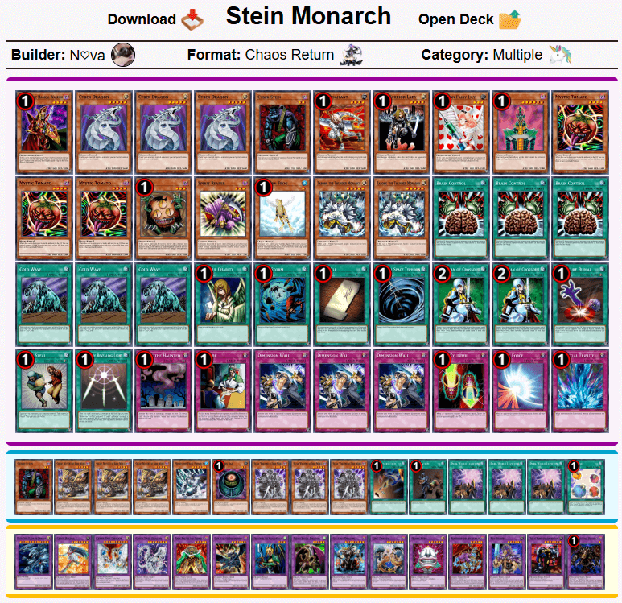
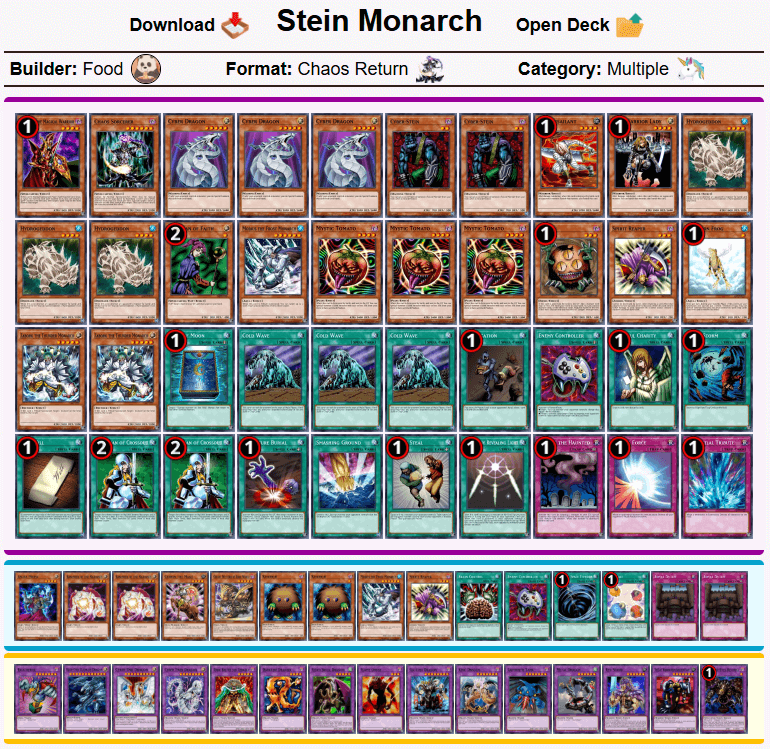

# 巫师大满贯2：混沌归还遗迹 现代上位搬运
来源：游戏王赛制库  
地址：https://www.formatlibrary.com/events/SORC02  
译者：本文卡组的卡池卡表虽然与408环境基本相同，但由于适用规则、调整裁定有差别，且TCG相比同时期OCG缺少部分卡片，建议参考时略作修改再用于408环境游戏。原文有饼图与卡片投入统计数据，但难以搬运，略过。  

[返回卡组分享（搬运·翻译）](../../Deck_Transport.html)

---

## 巫师大满贯2：混沌归还遗迹（Sorcerer Slam 2: Chaos Return Remains）
冠军：N♡va  
社团（指举办方）：混沌归还（Chaos Return）  
参赛者：23  
赛制：混沌归还  
冠军卡组：科学怪人帝王  
日期：2024年12月29日（当地时间）  

    
     
    科学怪人帝王 - N♡va - 冠军

---

    
     
    混沌控制 - OupsOfCow - 亚军

---

    
     
    科学怪人帝王 - Jaina - 四强

---

    
     
    科学怪人帝王 - splevin - 四强

---

    
     
    科学怪人帝王 - Food - 八强

---

    
     
    混沌“战士” - Infinity Soul - 八强

---

    
     
    混沌控制 - PradaG1337 - 八强

---

    
     
    混沌控制 - dump truck - 八强

