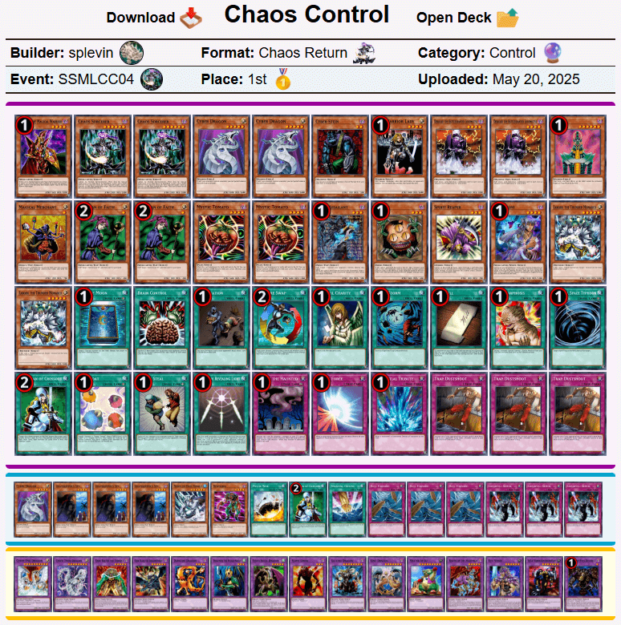
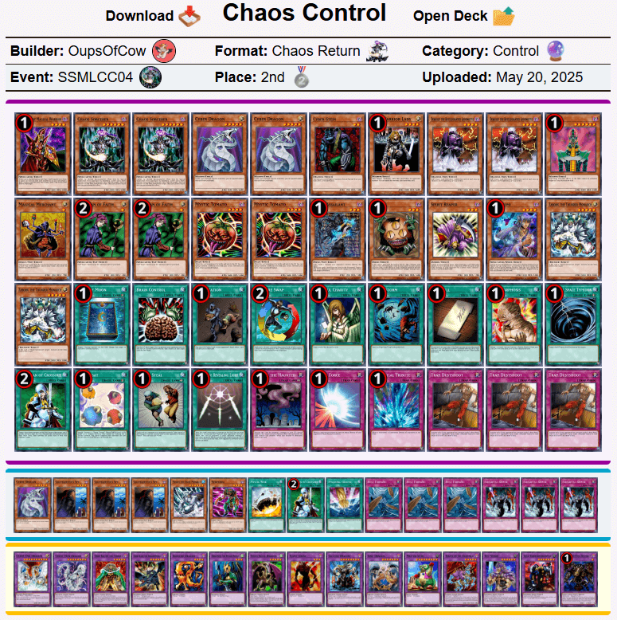

# 巫师大满贯4：“更像混沌均” 现代上位搬运
## 注意事项
- **规则差异**：TCG与OCG卡池存在部分卡牌差异，建议参考时结合最新规则、调整裁定修改构筑  
- **数据来源**：[游戏王赛制库](https://formatlibrary.com/events/SSMLCC04)  

[返回卡组分享（搬运·翻译）](../../Deck_Transport.html)

---

## 赛事基础信息

- **比赛名称**：巫师大满贯4：“更像混沌均”（Sorcerer Slam 4: "More Like Chaos Control"）  
- **战报发布日期**：2025-5-20  
- **参赛人数**：11  
- **赛制**：混沌归还  
- **比赛日期**：2025年5月11日（当地时间）  

---

## 冠军信息
- **选手ID**：splevin
- **夺冠卡组**：混沌均（注：以后翻译风格使用OCG风，“Control”翻译为“均”而非“控制”）  
- **举办方**：混沌归还（Chaos Return）  

---

## 比赛结果速览

    
     
    混沌均 - splevin - 冠军

---

    
     
    混沌均 - OupsOfCow - 亚军

---

没错原文图片就是两个完全一样的卡组