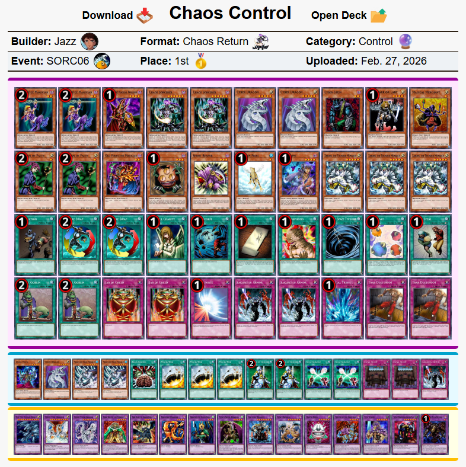
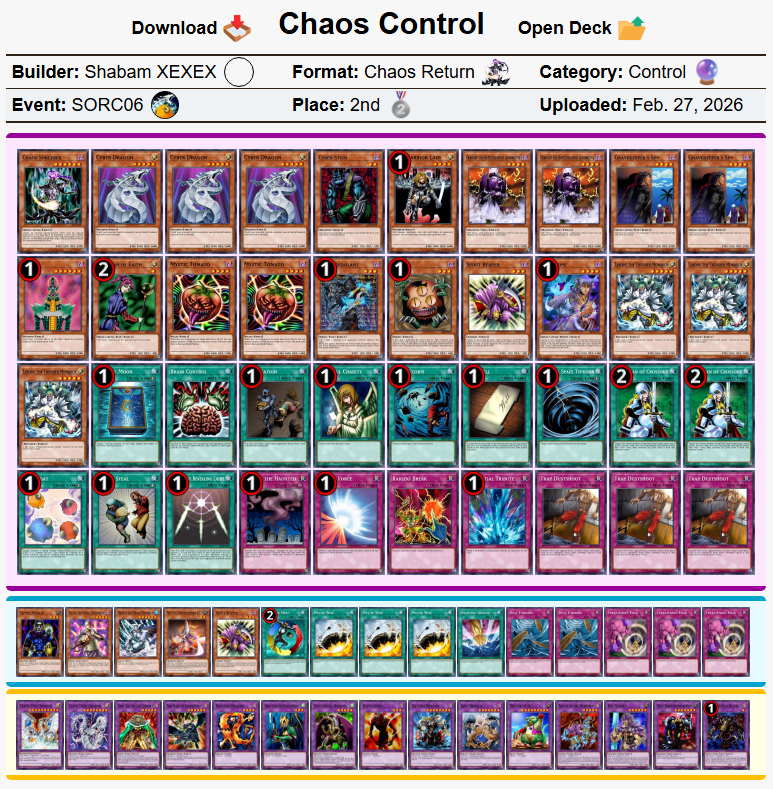
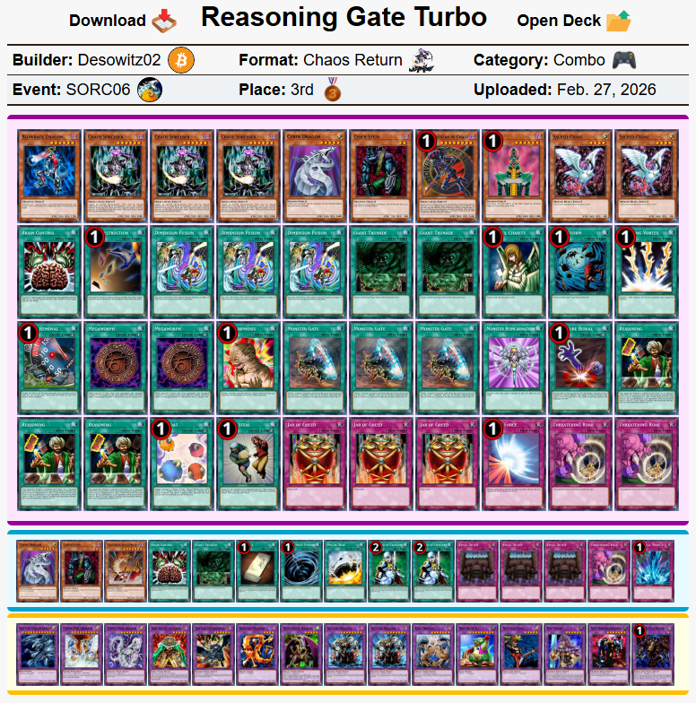
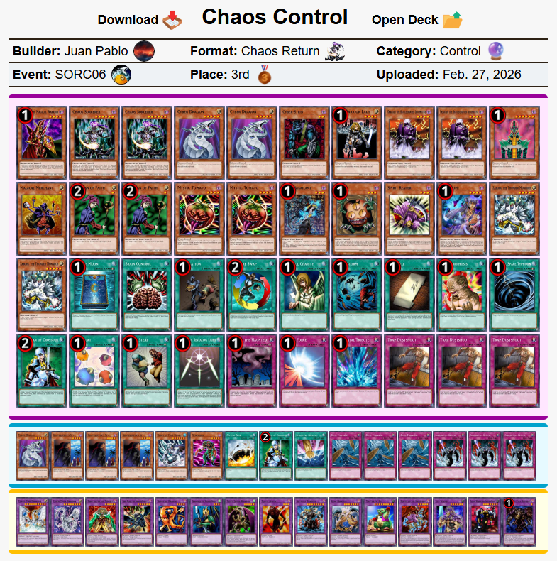
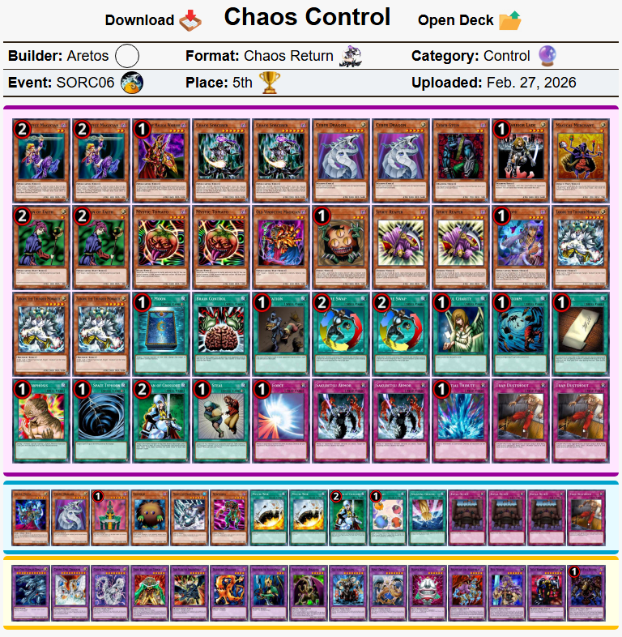
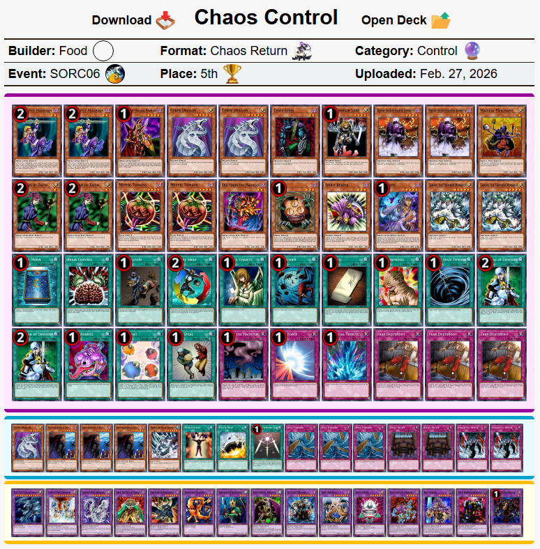
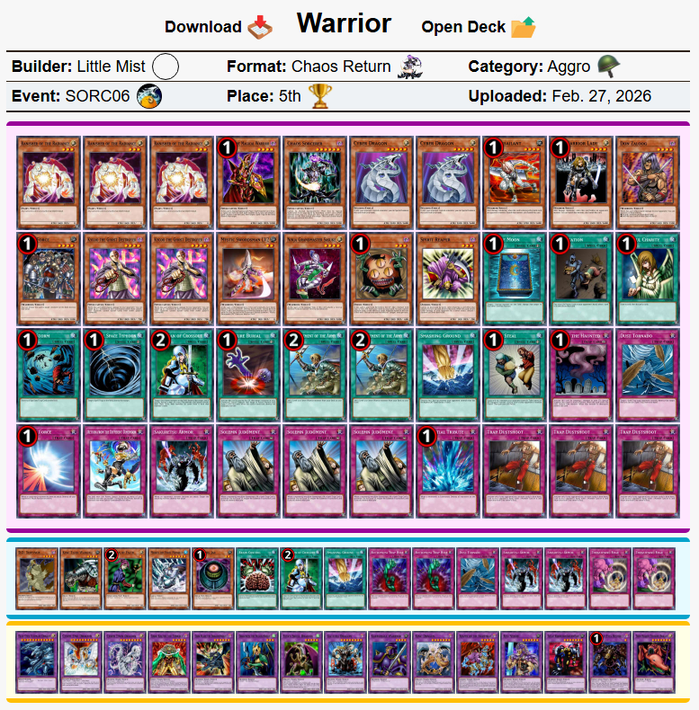
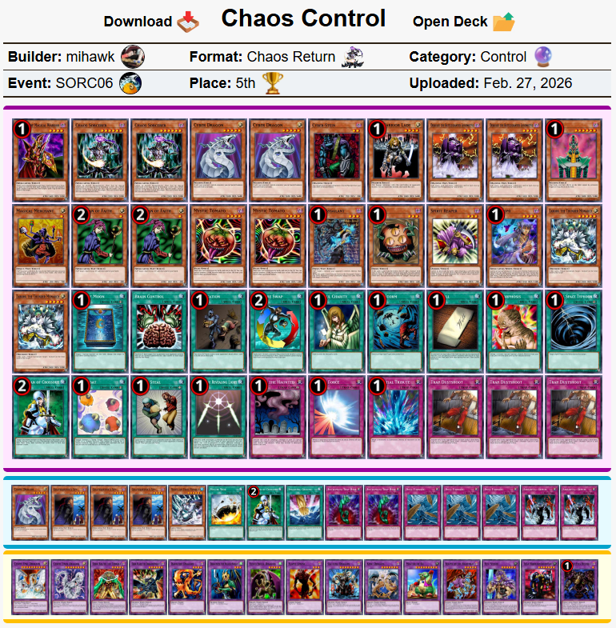

# 巫师大满贯6：“爵士健身操” 现代上位搬运

# **注意事项**

- **规则差异**：TCG与OCG卡池存在部分卡牌差异，采用历史规则，与408环境标准版略有不同，建议根据实际情况微调构筑
- **数据来源**：[游戏王赛制库](https://formatlibrary.com/events/SORC06)
- 翻译偏向OCG风格，“Control”翻译为“均”而非“控制”

[返回卡组分享（搬运·翻译）](../../Deck_Transport.html)  

---

# **赛事基础信息**

- **比赛名称**：巫师大满贯6：爵士健身操（Sorcerer Slam 6: "Jazzercise"）
- **战报发布日期**：2026-02-08
- **参赛人数**：23
- **赛制**：混沌归还
- **比赛日期**：2026年2月8日（当地时间）

---

# **冠军信息**

- **选手ID**：Jazz
- **夺冠卡组**：混沌均
- **举办方**：电子羊中心（Cyber Goat Central）

---

# **比赛结果速览**

    
     
    混沌均 - Jazz - 冠军

---

    
     
    混沌均 - Shabam XEXEX - 亚军

---

    
     
    推理门 - Desowitz02 - 四强

---

    
     
    混沌均 - Juan Pablo - 四强

---

    
     
    混沌均 - Aretos - 八强

---

    
     
    混沌均 - Food - 八强

---

    
     
    战士族 - Little Mist - 八强

---

    
     
    混沌均 - mihawk - 八强

