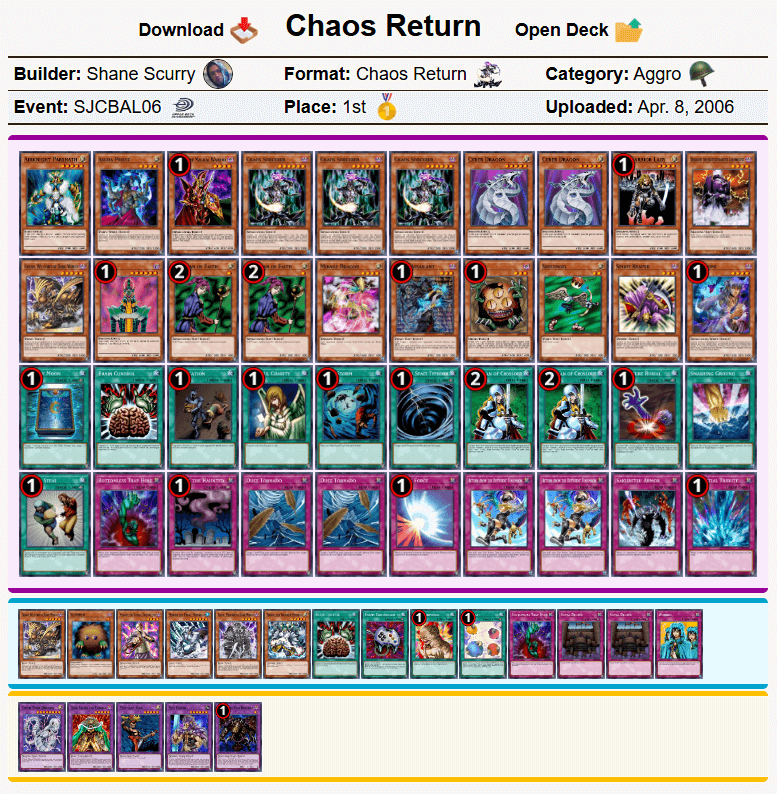
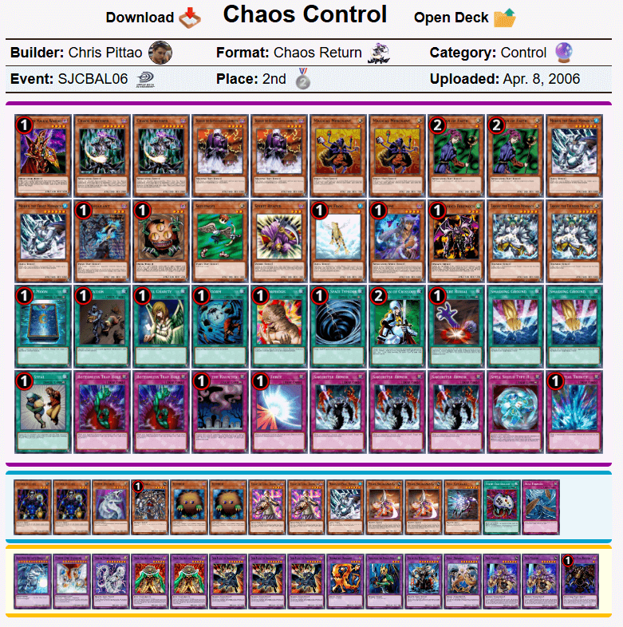
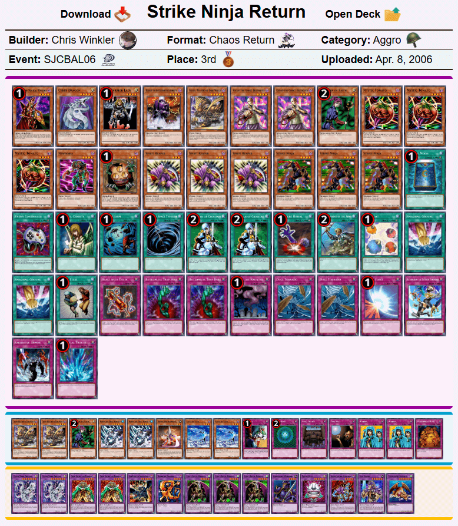
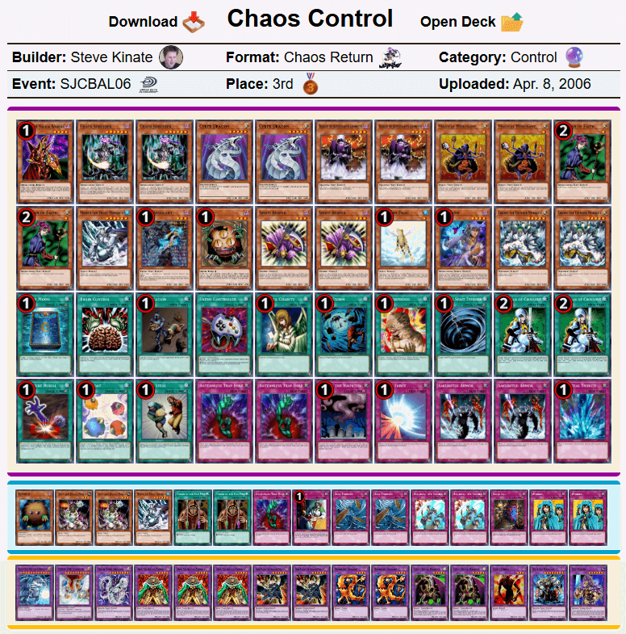
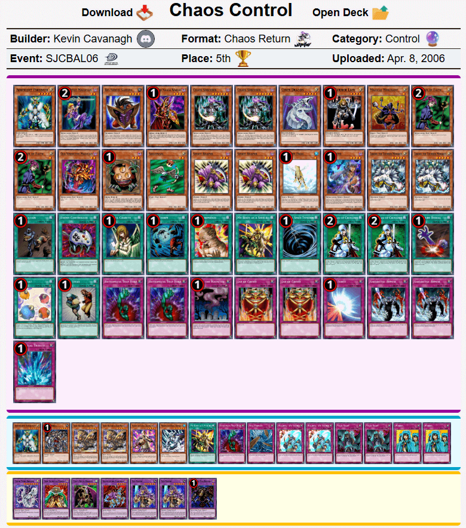
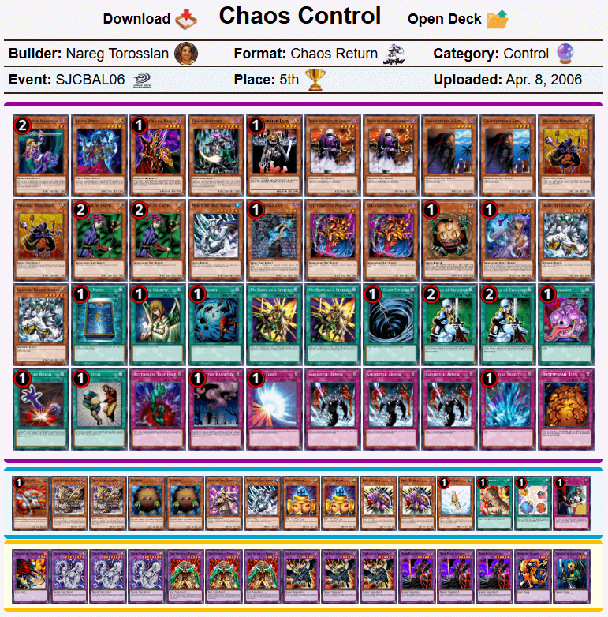

# Baltimore 2006历史上位搬运
来源：游戏王赛制库  
地址：https://www.formatlibrary.com/events/SJCBAL06  
译者：本文卡组的卡池卡表虽然与408环境基本相同，但由于适用规则、调整裁定有差别，且TCG相比同时期OCG缺少部分卡片，建议参考时略作修改再用于408环境游戏。  

[返回卡组分享（搬运·翻译）](../../Deck_Transport.html)

---

## SJC巴尔的摩2006
冠军：Shane Scurry  
社团（指举办方）：Upper Deck Entertainment  
参赛者：540  
赛制：混沌归还  
冠军卡组：混沌归还  
日期：2006年4月8日（当地时间）  

    
     
    混沌归还 - Shane Scurry - 冠军

---

    
     
    混沌控制 - Chris Pittao - 亚军

---

    
     
    速攻忍者归还 - Chris Winkler - 四强

---

    
     
    混沌控制 - Steve Kinate - 四强

---

    
     
    混沌控制 - Kevin Cavanagh - 八强

---

    
     
    混沌控制 - LaBounty - 八强

---

    
     
    混沌控制 - Nareg Torossian - 八强

---

    
     
    混沌控制 - Roy St. Clair - 八强

