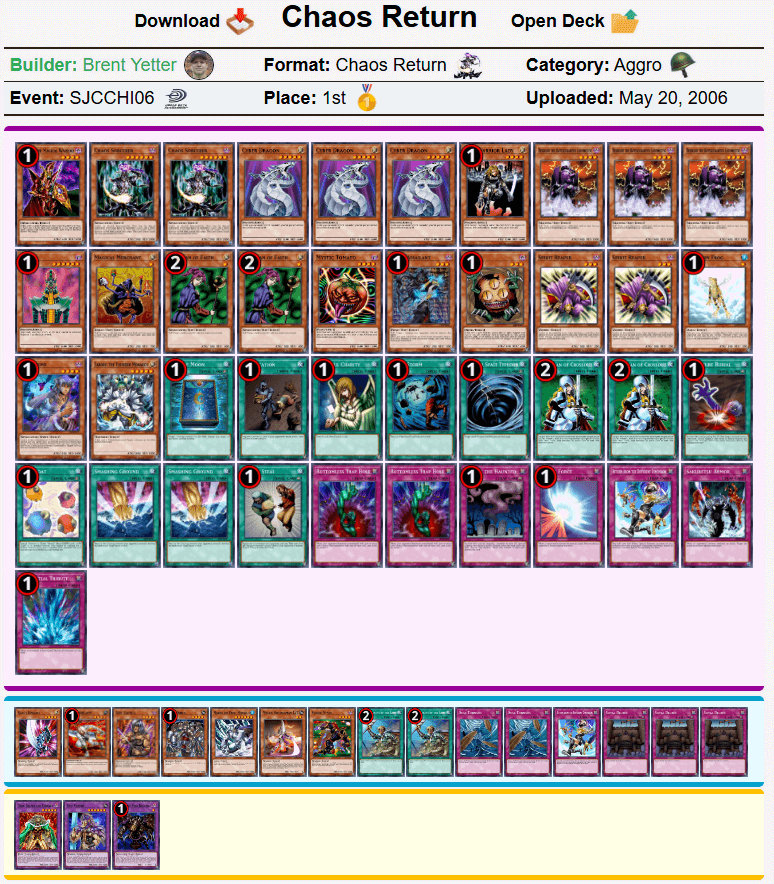
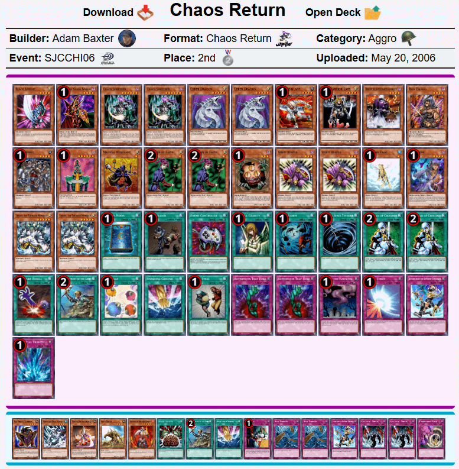
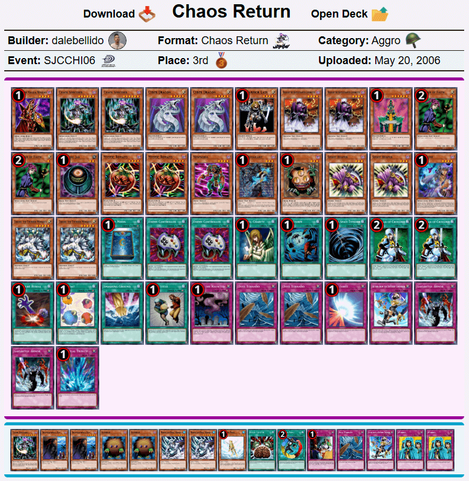
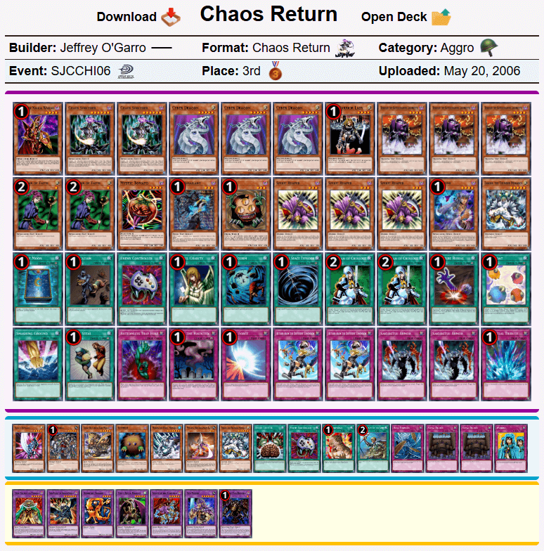
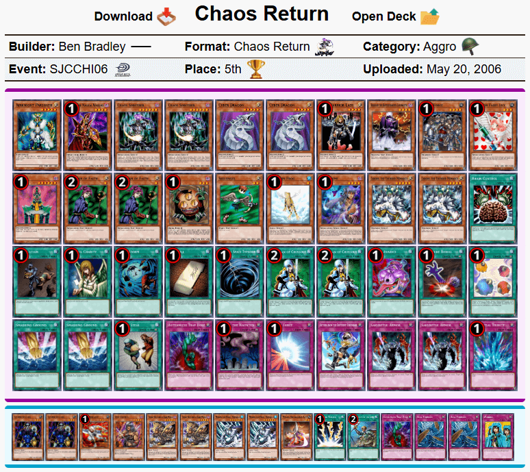
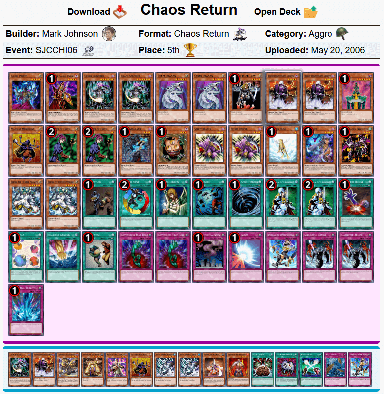
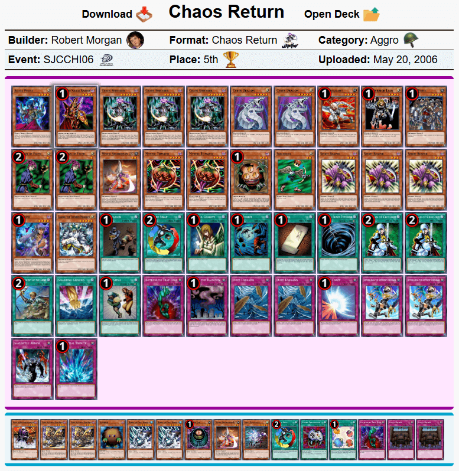

# SJC Chicago 2006历史上位搬运
来源：游戏王赛制库  
地址：https://www.formatlibrary.com/events/SJCCHI06  
译者：本文卡组的卡池卡表虽然与408环境基本相同，但由于适用规则、调整裁定有差别，且TCG相比同时期OCG缺少部分卡片，建议参考时略作修改再用于408环境游戏。  

[返回卡组分享（搬运·翻译）](../../Deck_Transport.html)

---

## SJC芝加哥2006
冠军：Brent Yetter  
社团（指举办方）：Upper Deck Entertainment  
参赛者：332  
赛制：混沌归还  
冠军卡组：混沌控制  
日期：2006年5月20日（当地时间）  

    
     
    混沌归还 - Brent Yetter - 冠军

---

    
     
    混沌归还 - Adam Baxter - 亚军

---

    
     
    混沌归还 - Dale Bellido - 四强

---

    
     
    混沌归还 - Jeffrey O'Garro - 四强

---

    
     
    混沌归还 - Ben Bradley - 八强

---

    
     
    混沌控制 - Edgar Flores - 八强

---

    
     
    混沌归还 - Mark Johnson - 八强

---

    
     
    混沌归还 - Robert Morgan - 八强

