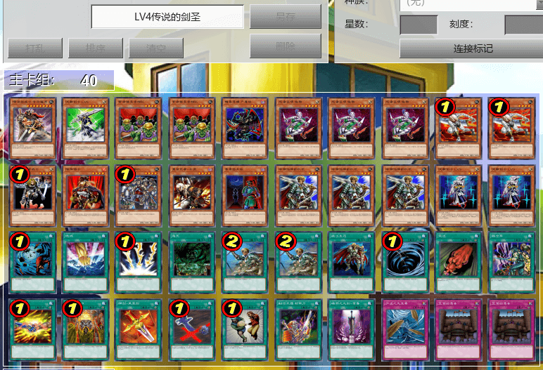

# 游戏王EX2006（GBA）NPC卡组

来源：《EX2006NPC卡组ygo2版本（不定时更新）》（https://tieba.baidu.com/p/8351845067）  
《谁还有全NPC卡组？》(https://tieba.baidu.com/p/4736786800)  
电子游戏《游戏王EX2006》的卡池较408环境要少数十张，且默认限制卡表与408环境并非完全相同，但可参考并修改后用于408环境游戏。  

[返回卡组分享（搬运·翻译）](../../../Deck_Transport.html)

---

## LV1

    
     
    白骨

---

    
     
    棉花球

---

    
     
    白魔导士 绒儿

---

    
     
    栗子球

---

    
     
    替罪羊

## LV2

    
     
    电池人-单三型

---

    
     
    哥布林王

---

    
     
    扰乱·黄

---

    
     
    水龙

---

    
     
    死亡青蛙

## LV3

    
     
    海龙神-尼奥泰达路斯

---

    
     
    双子太阳 赫利俄斯

---

    
     
    吸血鬼创世主

---

    
     
    狱火帝皇

---

    
     
    真红眼暗龙

## LV4

    
     
    暗黑界的武神 高尔德

---

    
     
    传说的战士 吉尔福德

---

    
     
    黑魔导执行官

---

    
     
    守护神 艾克佐德

---

    
     
    元素英雄 永生侠

## LV5

    
     
    电子终结龙

---

    
     
    荷鲁斯之黑炎龙 LV8

---

    
     
    幻魔皇 拉比艾尔

---

    
     
    机动城 堡垒

---

    
     
    奈芙提斯之凤凰神

