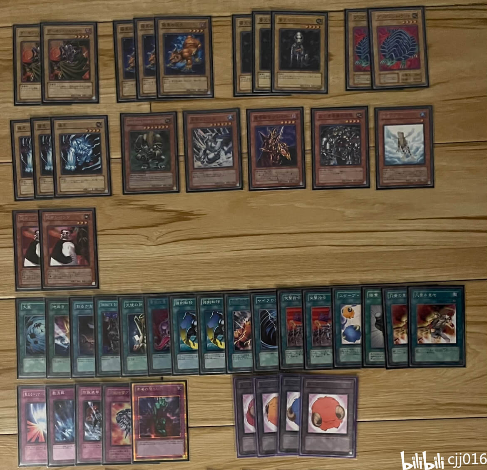
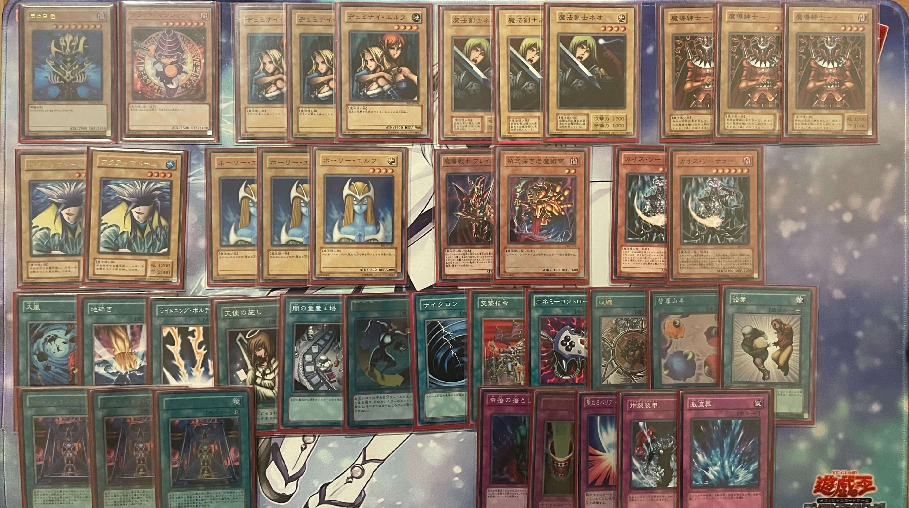
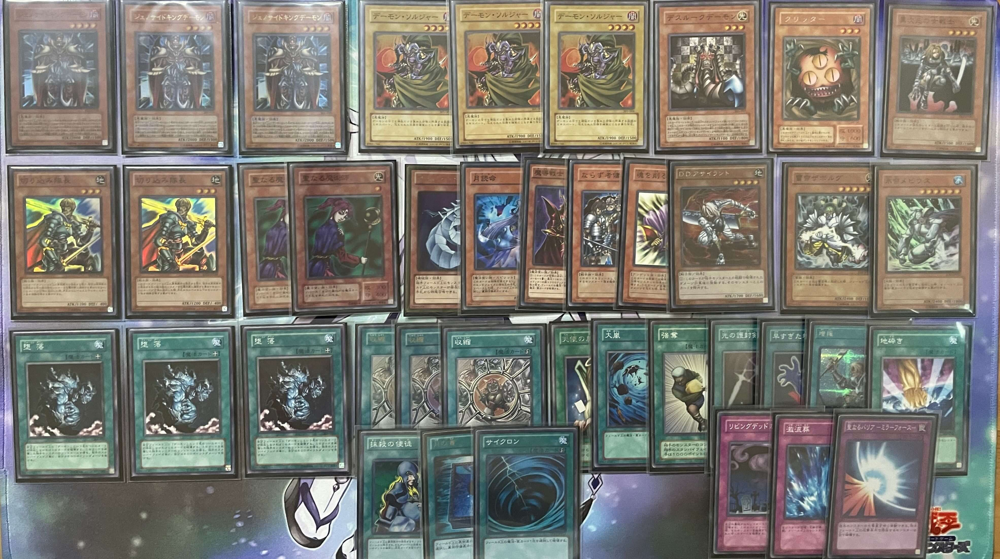

# 玩家“cjj016”卡组分享专栏合集（2023.12.25-2024.3.22）

**【注意】**仅提供构筑灵感，不保证强度、胜率，也不建议直接手抄。自己构筑、改进的卡组玩起来会更有游戏体验。

## 注意事项

- **数据来源**：详见每个卡组，原专栏链接有更详细的战术讲解
- **群友采用类复古规则，与408环境标准版略有不同，建议根据实际情况微调构筑**

---

 

    
     
    原专栏链接：https://www.bilibili.com/read/cv28768872/
     
    卡组名称（笔者判断）：兽族
     
    卡组类型（笔者判断）：beat

---

    
     
    原专栏链接：https://www.bilibili.com/read/cv29028398/
     
    卡组名称（笔者判断）：水属性
     
    卡组类型（笔者判断）：beat

---

    
     
    原专栏链接：https://www.bilibili.com/opus/905656925961584672
     
    卡组名称（笔者判断）：混沌
     
    卡组类型（笔者判断）：beat

---

    
     
    原专栏链接：https://www.bilibili.com/opus/911417477842337795
     
    卡组名称（笔者判断）：象棋恶魔
     
    卡组类型（笔者判断）：beat

