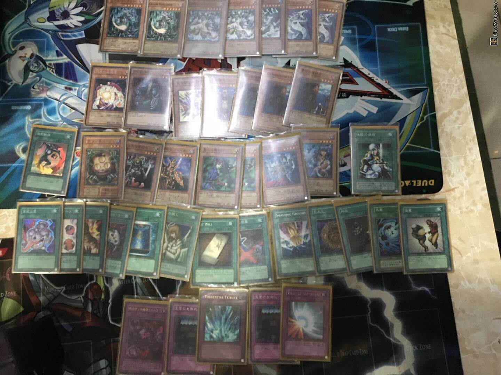
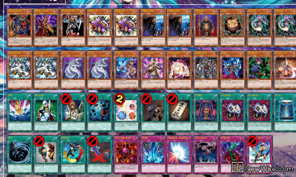
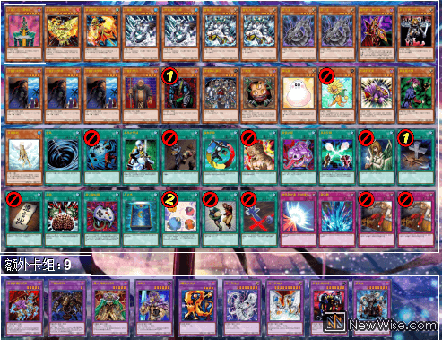

# 广州sky fire店赛特约 真· 情怀游戏王决斗（2019-5-2）战报搬运

## 注意事项

- **数据来源**：[任天堂世界论坛](https://bbs.newwise.com/thread-955390-1-1.html)
- **群友线下赛采用类复古规则，与408环境标准版略有不同，建议根据实际情况微调构筑**

[返回卡组分享（搬运·翻译）](../../../Deck_Transport.html)  

---

## 赛事基础信息

- **比赛名称**：广州sky fire店赛特约 真· 情怀游戏王决斗
- **战报发布日期**：2019年5月3日
- **参赛人数**：未知
- **比赛日期**：2019年5月2日

---

## 比赛结果速览（可能隐藏副卡组？）

    
     
    冠军：混沌（书记）

---

    
     
    亚军：混沌（陈志伟）

---

    
     
    季军：帝王（龙骑）

