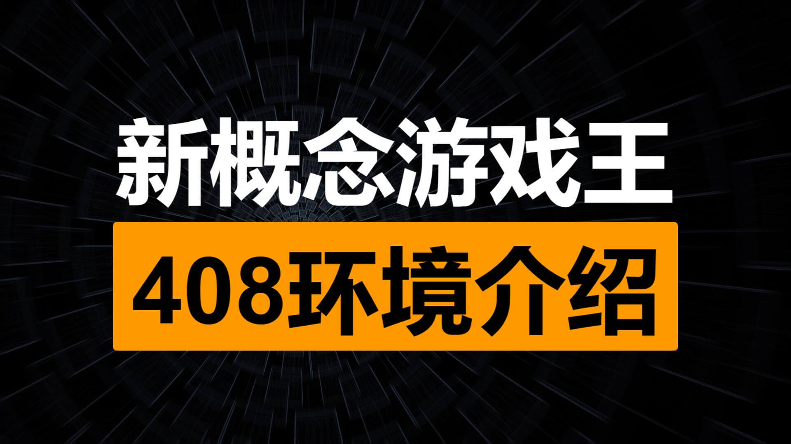
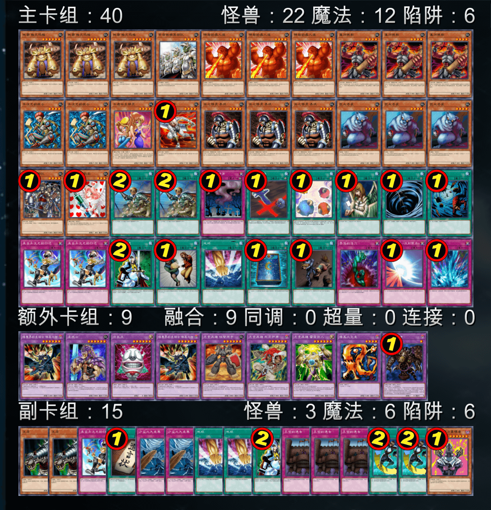

## 【新概念游戏王】408环境介绍（低门槛轻度桌游）V3

[返回首页](https://masteryuten.github.io/ygo408/)

---

目录：  
一、核心特色  
二、规则说明  
三、卡池范围  
四、推荐卡组  
五、对战指南  
六、结语  

> “（2006年3月表后的第四期OCG）这段时间的游戏环境，绝对可以称得上是有史以来最健康的了”——旅法师营地《【营地聊牌】游戏王实卡发展简史（4）》
> 视频：https://www.bilibili.com/video/BV115411n77U/

---

### 一、核心特色

408环境是以大师规则2020为基础，融合经典策略玩法的轻量化对战模组。节奏明快兼具策略深度，单局时长约10-15分钟，特别适合作为现代桌游入门选择。  
本环境三大核心优势：  
✅ 操作友好：90%以上卡牌效果简洁直白，平均每回合操作3-5步  
✅ 回合制博弈：每回合资源交换清晰可见，战术决策留有充分应对时间  
✅ 成本亲民：实卡构筑百元左右可成型，线上对战完全免费  

崇 高 力 量

---

### 二、规则说明

▷ 采用大师规则2020（不适用额外怪兽区）  
▷ 改订前效果+最新裁定  
▷ 2006年3月限制卡表+第四期完整卡池  
*保留经典策略框架，同时规避旧规则复杂度  

---

### 三、卡池范围

包含2006年4月前发售的全部四期卡牌（POTD卡包发售前），共约2386张卡牌。新手可通过以下方式快速掌握：  
▶ 网战软件：YGOPro、YGOMobile内置卡包筛选功能，打408环境补丁后可以直接查询。  
▶ 在线表格：https://docs.qq.com/sheet/DQWF4VkVUTnNlQk1D?tab=000001  

---

### 四、推荐卡组

#### 1.混沌

卡组提供：第十一届汉☆诺☆杯（线上赛）冠军 sanfandeng

以「混沌巫师」为核心，通过光暗属性资源循环实现高效解场。

#### 2.Good Stuff（均卡）

卡组提供：第九届汉☆诺☆杯（线上赛）亚军 薯片

集结「异次元女战士」「圣魔术师」等泛用强卡，通过精准1换1建立资源优势。无固定套路但考验构筑智慧，适合喜欢研究单卡联动的策略型玩家。

#### 3.帝王

卡组提供：第六届汉☆诺☆杯（线上赛）冠军 冰火仙

黄泉青蛙+上级召唤的节奏控制大师。

#### 4.零件

卡组提供：第十六届汉☆诺☆杯（线上赛）冠军 阿伟

三色零件永动机系统，持续铺场压制+OTK潜力。

#### 5.不死均

卡组提供：第十届汉☆诺☆杯（线上赛）季军 虹霓

「金字塔龟」展开体系，墓地资源循环利用专家。

#### 6.地属性均

卡组提供：第十一届汉☆诺☆杯（线上赛）季军 321

简单暴力的高攻下级压制，萌新首选卡组。

---

### 五、对战指南

#### 【线上对战】

1️⃣ 萌卡服务器直连：koishi.momobako.com:408卡组合规即可（暂需约战）  

2️⃣ 懒人整合包：QQ群912340958或网盘https://pan.baidu.com/s/14vqrqXSJfsh7dVdnW2535w?pwd=1919 电脑懒人包下载即玩  

#### 【实卡构筑】

▶ 一般卡组：100元左右可成型  
▶ 低配方案：打印版成本＜30元（学生党友好）  
参考文件https://pan.baidu.com/s/14vqrqXSJfsh7dVdnW2535w?pwd=1919  

#### 【网络资料】

▶ B站up主神之吹息视频、专栏  
▶ NGA（艾泽拉斯国家地理）论坛游戏王版408环境分版https://bbs.nga.cn/thread.php?stid=32438497  
▶ 百度“游戏王408环境”吧  

---

### 六、结语

408环境作为现代规则下的轻量化对战模组，既保留了策略卡牌的核心乐趣，又大幅降低了学习成本。无论你是：  
→ 想尝试卡牌游戏的桌游爱好者  
→ 寻找碎片化娱乐的上班族  
→ 希望建立游戏社团的学生群体  
这里都能找到属于自己的对战乐趣。  
开启你的第一场408环境决斗吧！

神之吹息

    2025年2月8日

