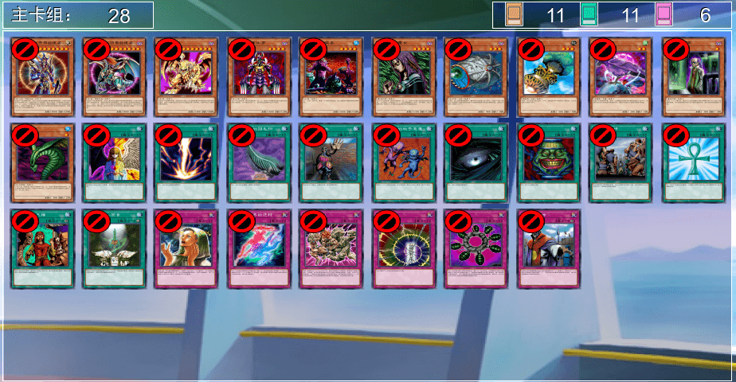
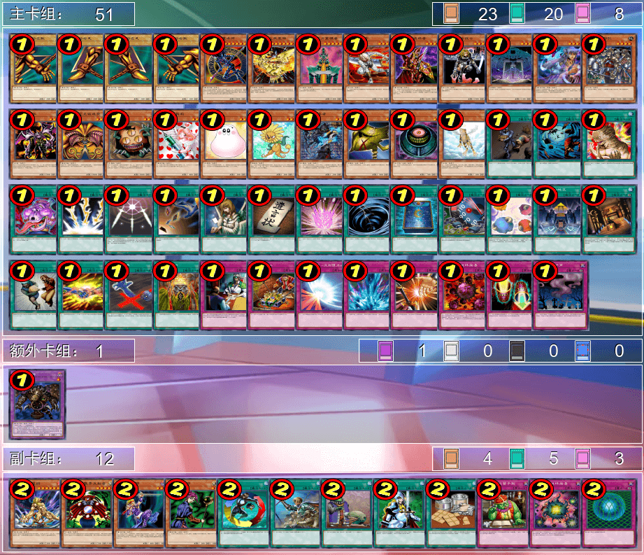
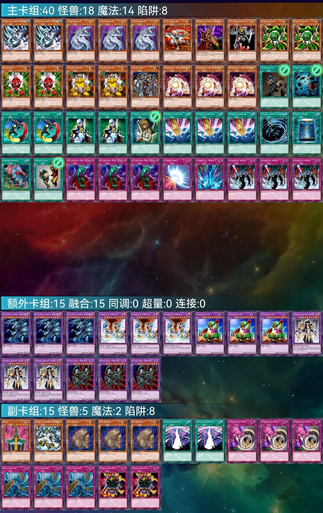
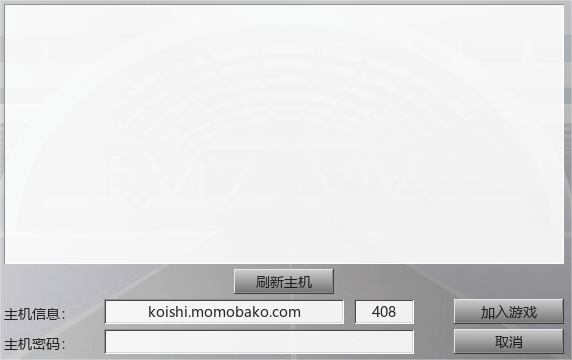

# 游戏王408环境介绍（低门槛轻度桌游）V4

[返回首页](../../index.html)  

---

    

目录：  
一、核心特色  
二、规则说明  
三、卡池范围  
四、推荐卡组  
五、对战指南  
六、结语  

> “（2006年3月表后的第四期OCG）这段时间的游戏环境，绝对可以称得上是有史以来最健康的了”——旅法师营地《【营地聊牌】游戏王实卡发展简史（4）》12:57  
> 视频：https://www.bilibili.com/video/BV115411n77U/

---

## 一、核心特色

408环境是以大师规则2020为基础，融合经典策略玩法的轻量化对战模组。节奏明快兼具策略深度，单局时长约10-15分钟，特别适合作为现代桌游入门选择。  
本环境三大核心优势：  
✅ 操作友好：90%以上卡牌效果简洁直白，平均每回合操作3-5步  
✅ 回合制博弈：每回合资源交换清晰可见，战术决策留有充分应对时间  
✅ 成本亲民：实卡构筑百元左右可成型，线上对战完全免费  

    
     
    崇 高 力 量

---

## 二、规则说明

▷ 采用大师规则2020（不适用额外怪兽区）  
▷ 改订前效果+最新裁定  
▷ 传承自2006年3月限制卡表+第四期卡池  
*保留经典策略框架，同时规避旧规则复杂度  

    
     
    禁止卡

    
     
    限制卡·准限制卡

### 使用大师规则2020（不适用额外怪兽区）的原因

1. **降低学习门槛**  
   简化规则、沿用OCG环境玩家熟悉的操作，避免早期规则中复杂的规则、裁定争议（起动效果优先权、伤害步骤时点模糊等），同时保留经典策略（如资源交换、卡差理论），兼顾新老玩家需求，并能快速适应。
2. **统一裁判标准**  
   大师规则2020经多年优化，裁定争议少于旧规则，且能及时获得KONAMI官方或民间裁判、规则研究爱好者的技术支持，减少线上/线下比赛的判罚纠纷，保障对战流畅性。
3. **扩大受众定位**  
   以“旧卡池+新规则”组合弱化纯怀旧标签，减少“老玩家专属”误解，突出轻量化、低门槛特性（如短时长对局、简化操作），吸引非核心玩家（动画观众、桌游爱好者）参与。
4. **促进社群融合**  
   OCG环境玩家通过熟悉规则“软着陆”，老玩家重温经典战术，形成跨世代交流。兼容主流对战平台（如YGOPro）进一步降低参与壁垒。
5. **降低维护成本**  
   复用现有对战系统与规则文档，无需为适配旧规则开发独立技术框架；固定卡池设计规避新卡迭代压力，保障长期运营可持续性，规避环境荒废、玩家心血白费悲剧。
- **总结**
  - 通过**规则现代化与卡池复古化错位融合**，既保留早期环境的策略特色，又利用成熟规则体系优化体验，形成兼具怀旧情怀色彩与竞技活力的独立生态，成为连接多代玩家的桥梁。
  - 原有规则更多是情怀和记忆，代表过去，予以尊重。大师规则2020（不适用额外怪兽区）更高效合理，符合当下。

---

## 三、卡池范围

包含2006年4月前发售的全部四期卡牌（POTD卡包发售前），共约2386张卡牌。新手可通过以下方式快速掌握：  
▶ 网战软件：YGOPro、YGOMobile内置卡包筛选功能，打408环境补丁后可以直接查询。  
▶ [在线表格](../Cardpool%20Banlist/Cardpool.html)  

---

## 四、推荐卡组

### 1.混沌

    
     
    卡组提供：第十一届汉☆诺☆杯（线上赛）冠军 sanfandeng

以「混沌巫师」为核心，通过光暗属性资源循环实现高效解场。

### 2.Good Stuff（均卡）

    
     
    卡组提供：第九届汉☆诺☆杯（线上赛）亚军 薯片

集结「异次元女战士」「圣魔术师」等泛用强卡，通过精准1换1建立资源优势。无固定套路但考验构筑智慧，适合喜欢研究单卡联动的策略型玩家。

### 3.帝王

    
     
    卡组提供：第六届汉☆诺☆杯（线上赛）冠军 冰火仙

黄泉青蛙+上级召唤的节奏控制大师。

### 4.零件

    
     
    卡组提供：第十六届汉☆诺☆杯（线上赛）冠军 阿伟

三色零件永动机系统，持续铺场压制+OTK潜力。

### 5.不死均

    
     
    卡组提供：第十届汉☆诺☆杯（线上赛）季军 虹霓

「金字塔龟」展开体系，墓地资源循环利用专家。

### 6.地属性均

    
     
    卡组提供：第十一届汉☆诺☆杯（线上赛）季军 321

简单暴力的高攻下级压制，萌新首选卡组。

---

## 五、对战指南

### 线上对战

1️⃣ 萌卡服务器直连：koishi.momobako.com:408卡组合规即可（暂需约战）  

    
     
    408端口（MC服）

2️⃣ 懒人整合包：QQ群912340958或网盘https://pan.baidu.com/s/14vqrqXSJfsh7dVdnW2535w?pwd=1919 电脑懒人包下载即玩  

    
     
    引导群

### 实卡构筑

▶ 一般卡组：100元左右可成型  
▶ 低配方案：打印版成本＜30元（学生党友好）  
参考文件https://pan.baidu.com/s/14vqrqXSJfsh7dVdnW2535w?pwd=1919  

### 网络资料

▶ [B站up主神之吹息](https://space.bilibili.com/839586)视频、专栏  
▶ [NGA（艾泽拉斯国家地理）论坛游戏王版408环境分版](https://bbs.nga.cn/thread.php?stid=32438497)  
▶ [百度“游戏王408环境”吧](https://tieba.baidu.com/f?kw=%E6%B8%B8%E6%88%8F%E7%8E%8B408%E7%8E%AF%E5%A2%83)  

---

## 六、结语

       

408环境作为现代规则下的轻量化对战模组，既保留了策略卡牌的核心乐趣，又大幅降低了学习成本。无论你是：  
→ 想尝试卡牌游戏的桌游爱好者  
→ 寻找碎片化娱乐的上班族  
→ 希望建立游戏社团的学生群体  
这里都能找到属于自己的对战乐趣。  
开启你的第一场408环境决斗吧！

    神之吹息
     
    2025年4月9日

