# 官方规则书之大师规则（2020年4月1日修订版）选编（更新中）

编者：神之吹息

[返回首页](../../../index.html)

---

> **编者前言** 
> ①根据观察结果与实践经验，特搬运、选编本篇基础规则，望能帮各位玩家提升游戏理解。
> ②以[简体中文版《官方规则书之大师规则(2020年4月1日修订版)》](https://source.windoent.com/yugioh/rulebook_2020_SC_ver7.pdf)为基础，参考[日语原版《マスタールール(2020年4月1日改訂版)対応公式ルールブック》](https://www.yugioh-card.com/japan/howto/data/rulebook_masterrule20200401_ver1.0.pdf)校对，有少量**修正、编注**。
> ③简化与408环境关联性较小、不会接触的**OCG环境**部分，欲了解可自行查看PDF文件或实体小册子原文。插图存在408环境卡池外的卡，仅用于解释规则。
> ④文字部分的**专有名词、卡名**等会尽可能换成更常用民间翻译。
> ⑤**电脑版左侧**有可跳转目录。

## 初级编 学习决斗的基础

### 对战必需品

“游戏王官方卡片游戏决斗怪兽”中1次对战就决出胜负的场合被称为“决斗”，在进行3次“决斗”的“比赛”中决出胜者。
进行决斗时请使用以下道具。

- 卡组（40张以上60张以下）
“卡组”指的是自己在决斗中使用的卡集。需要准备的张数为40张以上60张以下。
本商品设计成可直接游戏的结构。也可使用自己喜欢的卡自由组合卡组。
- 方便好用的物品
  - 计算器
  计算器在计算伤害时十分便利。在没有计算器的场合，也可使用纸和铅笔记录基本分的变化。
  - 卡套
  保护卡不会被折或出现伤痕。在使用的场合请注意要使卡从背面等无法判别。使用卡套的场合，1个卡组应使用相同的产品。
  - 决斗场地
  用于摆放对战中所出的卡或已使用的卡。
  如果能记住卡摆放的位置，即使不使用决斗场地也可以决斗。

> **编者注** 游戏王中的“以上”“以下”包括本数。

### 决斗场地

决斗场地内，不同卡的摆放位置及其名称均有规定。
起始卡组等的组合套装中随附的场地为仅表示自己方场地的半面形态。实际游戏的场合，请与对方的场地对接在一起进行决斗。

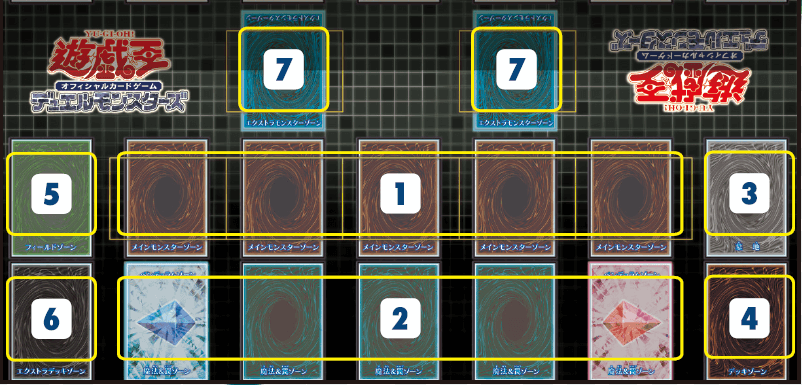

1. 主怪兽区域
指的是出怪兽卡的场所。最多可在主怪兽区域内出5只怪兽。
2. 魔法与陷阱区域
指的是使用魔法卡和陷阱卡时用于摆放的场所。最多可在魔法与陷阱区域放5张魔法·陷阱卡。
3. 墓地
是因战斗被破坏的怪兽卡或使用完毕的魔法·陷阱卡表侧朝上摆放的场所。
4. 卡组区域
是将自己的卡组里侧摆放的场所。玩家可从中抽卡放入自己的手卡。
5. 场地区域
魔法卡中的“场地魔法”卡将被摆放在此处。场地魔法不包括在摆放于魔法与陷阱区域的5张魔法与陷阱区域卡内。
6. 额外卡组区域
可用特殊方法出牌的“融合怪兽”里侧摆放的场所。
7. 额外怪兽区域（**408环境不适用**）

> **编者注** “表侧”即正面朝上，“里侧”为背面朝上。

### 怪兽卡的种类与使用方法

#### 如何看卡

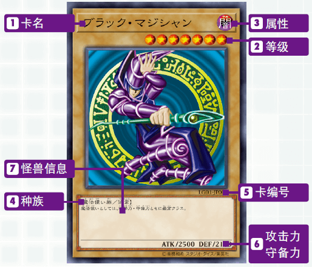

1. 卡名
此处显示的即为卡名。
按照规则，即使卡上的图片不同，只要卡名相同就作为同样的卡使用。
2. 等级
表示怪兽的等级。等级越高就表示是越强大的怪兽。
3. 属性
怪兽分为下边6种属性。部分卡效果中只对特定属性产生影响。

4. 种族
怪兽分为很多个种族。此外，拥有特定能力的怪兽的能力名有时会表示在此处。

|        | 部分种族 |        |
| :----: | :------: | :----: |
| 魔法师 |   恶魔   |  机械  |
|   龙   |   天使   |   水   |
|  不死  |   昆虫   |   炎   |
|  战士  |   恐龙   |  岩石  |
|   兽   |   海龙   | 电子界 |

5. 卡编号
记载有卡包系列和系列中的通用编号。整理卡或搜索数据时看这块内容会很方便。
6. 攻击力·守备力
ATK表示怪兽的攻击力，DEF表示守备力。数值越高，就越有利于怪兽之间的战斗。
7. 怪兽信息
如果是通常怪兽，就记录其性格、特征等的相关解说，如果是其他怪兽，则记录卡的效果和使用方法等。此处记录的效果怪兽等的特殊能力在以里侧表示的方式放在场上的场合一般无法发挥效果，这一点需要注意。

#### 何为怪兽卡

怪兽卡是指在战斗中与对方怪兽进行攻防或对对方玩家进行攻击的卡。
决斗的基本玩法就是使用该卡进行怪兽战斗。
怪兽卡的种类极其繁多，实际上存在各种各样的卡。如果只是单纯的战斗，攻击力和守备力较高的卡就比较强，但也有虽然攻击力和守备力低但可以发挥特殊效果的卡，如何熟练使用这种卡是决定胜负的关键。
初级编中会介绍各种类型的怪兽卡。

- 通常怪兽
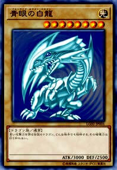
不具有特殊效果的基础怪兽。正因为不具有效果，其中有很多攻击力和守备力较高的怪兽。
- 效果怪兽
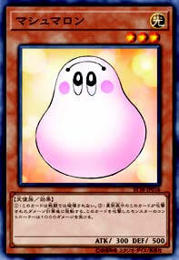
虽然身为怪兽，但可以发挥类似魔法卡效果的就是效果怪兽。
- 其他怪兽卡
除此之外还存在以下这些怪兽卡。这些怪兽可根据特定方法被呼叫出来，发挥出各种效果。
  - 融合怪兽
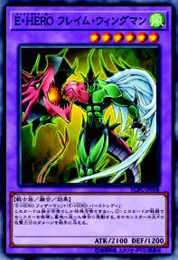
  - 仪式怪兽
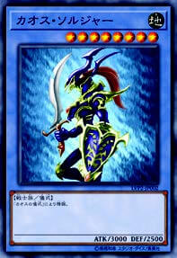

> **关于怪兽的表示形式**
> 怪兽分为纵向摆放的攻击表示和横向摆放的守备表示，根据决斗进程可以变更表示形式。

### 怪兽的召唤

出怪兽的方法的种类如下，分为1个回合仅限进行1次的召唤和不限制次数的召唤。大致的分类是将召唤·盖放称为“通常召唤”，而与之相对的是，用卡效果或特定步骤进行的召唤称为“特殊召唤”。

- 召唤（上级召唤）
从手卡中用表侧表示出在主怪兽区域的最普通的召唤方法。
用这种方法可以召唤通常怪兽以及召唤方法不设条件的效果怪兽。

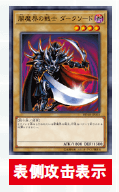

不过，要召唤等级5以上怪兽之前，必须要解放（=送去墓地）自己场上的其他怪兽。这称为“上级召唤”。
等级5·6的怪兽必须解放1只怪兽。
等级7以上的怪兽必须解放2只怪兽。

| 等级5·6 | 等级7以上 |
| :------: | :-------: |
| 解放1只  |  解放2只  |

> **编者注** 解放3只怪兽是因为卡上文本要求，基础规则无此规定。

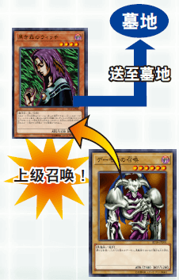

- 盖放
与召唤的要点相同，从手卡中用里侧表示的方式放在主怪兽区域就称为“盖放”。盖放等级5以上怪兽的场合也与召唤时一样，必须提前进行解放。

> **要点** 1个回合中只能在召唤（上级召唤）和盖放中择一进行1次。

- 反转召唤
玩家自己将自己场上的里侧守备表示怪兽变为表侧攻击表示的行为就称为“反转召唤”。
用反转召唤不可变为表侧守备表示。如此将里侧表示的怪兽变为表侧表示的玩法称为“反转”。

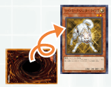

> **要点** 被盖放的怪兽不可在该回合中进行反转召唤

- 特殊召唤
以特殊步骤出怪兽称为“特殊召唤”。有用文本中记载的步骤呼叫出魔法·陷阱卡效果或效果怪兽的场合。
只要特殊召唤满足条件，1个回合中可以进行任意次。只要卡上没有特殊记载，特殊召唤可以表侧攻击表示或表侧守备表示出到场上。

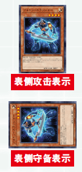

### 魔法·陷阱卡的种类与使用方法

#### 如何看卡

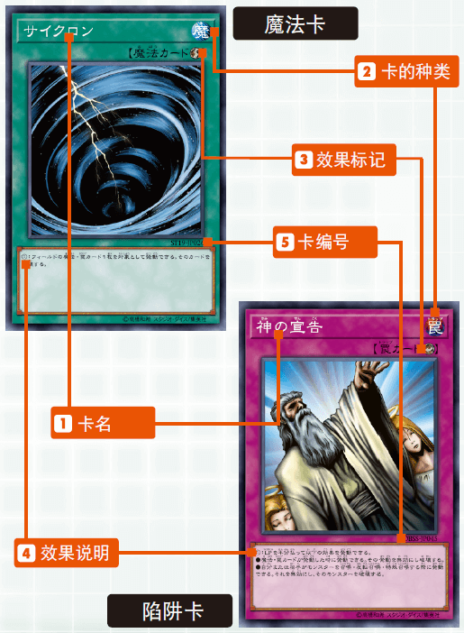

1. 卡名
和怪兽卡一样，按照规则，即使卡上的图片不同，只要卡名相同就作为同样的卡使用。
2. 卡的种类
作为怪兽属性标记的替代，每张魔法卡用“魔”的种类标记表示，陷阱卡用“罠”的种类标记表示。
3. 效果标记
魔法·陷阱卡的基本效果分为6种，分别用相应的标记表示。尽管魔法·陷阱卡种类丰富，但只要看到标记就能轻松判别是何种效果。没有标记的卡称为“通常魔法”或“通常陷阱”。

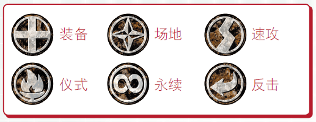

4. 效果说明
记载有各卡的发动条件及其效果。请仔细阅读后正确使用魔法·陷阱卡。
5. 卡编号
记载有卡包系列及其系列内的通用编号。整理卡或搜索数据时看这块内容会很方便。

#### 魔法卡

魔法卡一般是指可在自己的主要阶段使用的卡（速攻魔法为特例），用各种效果支持您的战斗。破坏卡、强化怪兽等攻击性的强力效果较多，除速攻魔法之外只能在自己的回合中发动，但可以自己盘算发动时间，这一点很有魅力。

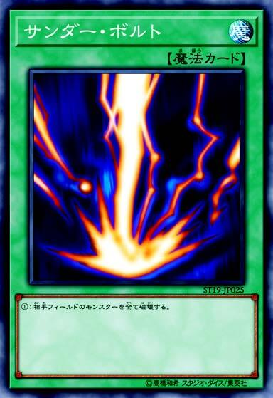

- 通常魔法
通常魔法是指一旦发动，完成效果处理后，将被送去墓地的一次性效果魔法。使用步骤：与发动宣告一同将该卡放在魔法与陷阱区域。如果发动成功就会进行效果处理。处理完成后魔法卡将被送去墓地。
- 仪式魔法
呼叫出被称为“仪式怪兽”的怪兽所必须的专用魔法卡。
- 永续魔法
发动后也继续留在场上，直到离开为止会一直发挥效果的魔法卡。
可期待1张卡长时间发挥效果虽然是魅力点，但也有可能从场上离开后就无法发挥效果。
- 装备魔法
给1只怪兽效果，发动后也会继续留在场上。与表侧怪兽重叠摆放，但仍作为自己的魔法与陷阱区域的1张卡计算。

> **编者注** 写是“重叠摆放”，但本人从未见过。实际只需放在魔法与陷阱区域即可。

- 场地魔法
放在专用场地区域的魔法。发动后也会继续留在场上。也可将自己的旧场地魔法送去墓地，发动新的场地魔法。
- 速攻魔法
在对方回合也可发动的特殊魔法卡。一般在任何时点都可发动，但如果要在对方回合发动必须提前盖放在魔法与陷阱区域。不过盖放后的回合中不可发动该卡。

#### 陷阱卡

陷阱卡和魔法卡一样可用各种效果支持战斗。不过和魔法卡大为不同的是，陷阱卡可以在对方回合中发动效果。魔法卡攻击效果较多，与之相对的是，陷阱卡的特点在于妨碍、突然袭击的效果较多。但发动需要配合对方的出法，这种卡比较难找到用的地方。

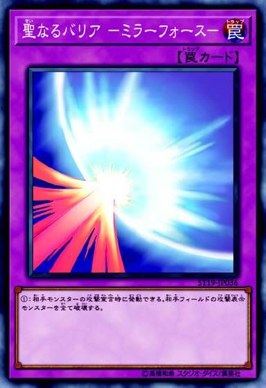

- 通常陷阱
陷阱卡的使用步骤：一般来说必须埋伏在魔法与陷阱区域，不可在盖放的回合发动。到下一回合之后在双方的回合都可发动。
一次性效果的通常陷阱和通常魔法一样，完成效果处理后就会被送去墓地。此外发动后效果难以被妨碍这一点也一样。但陷阱卡在盖放回合或发动条件齐全之前就很可能被对方破坏，所以使用时与对方的博弈十分重要。
- 永续陷阱
与永续魔法一样，发动后也会继续留在场上发挥效果的陷阱卡。此外，永续陷阱卡中也存在其效果与效果怪兽的效果相同的卡。
该卡的特征是，妨碍对方行动，或缓缓给对方施加伤害等效果较多。
- 反击陷阱
反击陷阱一般来说是针对卡的发动进行发动的陷阱卡，具有将该卡的发动本身无效化等效果。
对通常魔法或通常陷阱等难以妨碍其效果的卡也有效，但要发动这种类型的陷阱卡是有条件限制的。

> **魔法和陷阱的盖放区别**
> 魔法卡和陷阱卡一样，出卡前可以埋伏在场上。但之后卡的使用方法差别很大，需要注意。
> 除速攻魔法之外的魔法卡即使在埋伏出卡的回合中，只要是主要阶段就可以发动。但在对方回合中不可发动，之后也仅限在自己的主要阶段发动。

### 对战方法和决斗的准备

在与对方对战1次就定胜负的“决斗”中，双方各持有8000基本分开始游戏。先将对方基本分降至0
的玩家获胜。（双方基本分同时降至0则为平局。）

- 决斗的准备
  1. 对战中与对方打过招呼之后，将自己的卡组洗切后交给对战对方。双方接收对方的卡组后，稍作切牌进行混合。这种行为称作“切牌”。
  2. “切牌”之后双方将卡组还给持有者，放在场上的卡组区域内。使用额外卡组的场合，则与卡组的卡分开，放在额外卡组区域。
  3. 猜拳后胜者可选择自己先攻或后攻。
  4. 最后从自己卡组中抽出5张卡，这5张卡就成为决斗开始时的手卡。
- 从先攻玩家开始！

### 决斗的推进方法

决斗根据“回合”和“阶段”这两种分隔推进。

- 回合
回合指的是各玩家可发起行动的顺序。具体来说，就是决斗准备就绪后，先攻玩家开始第1个回合，之后与后攻玩家交替进行。
1个回合一般由6个阶段构成。
- 阶段
阶段用来明确区隔玩家在该回合中所进行的步骤。在自己的回合中依照下面的顺序推进，每个阶段中都对玩家行动有所限制。

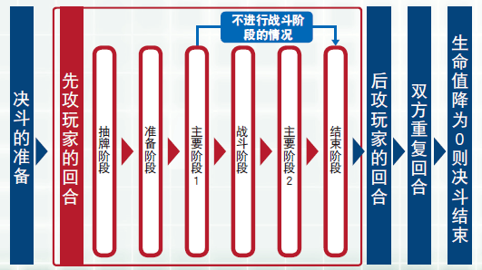

#### 在各个阶段可做的事

- 抽卡阶段
从卡组中抽出1张卡
※先攻玩家的第1个回合中不可抽卡
- 准备阶段
对写有“在准备阶段做～”的卡进行效果处理
- 主要阶段1
可最大限度地自由使用卡，包括召唤怪兽、盖放魔法·陷阱卡、发动卡效果等。
- 战斗阶段
使用怪兽卡进行战斗。
挑选自己的表侧攻击表示的怪兽，挑选攻击对象。
关于战斗的详情下文有具体说明。
※在先攻玩家的第1个回合不可进行战斗阶段。
- 主要阶段2
可做与主要阶段1同样的事，但进行有次数限制的行动的场合不可进行主要阶段2。
（例：召唤怪兽是1个回合1次，在主要阶段1已进行召唤的场合，主要阶段2则不可召唤。）
- 结束阶段
宣告回合结束。
手卡数量在7张以上的场合，则留下6张，其余丢弃。

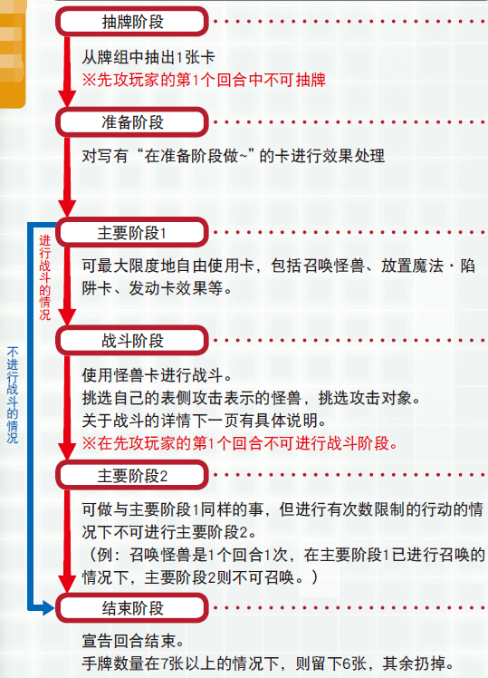

### 战斗伤害的计算方法 

战斗伤害的计算方法会根据作为攻击目标的对方怪兽的表示形式有所变化。攻击表示的场合比较对方怪兽的攻击力和自己的攻击怪兽的攻击力，守备表示的场合比较对方怪兽的守备力和自己的攻击怪兽的攻击力进行判定。

#### 攻击对方的攻击表示怪兽的场合

|      | 攻击怪兽的攻击力 VS 对方攻击表示怪兽的攻击力                 |
| ---- | ------------------------------------------------------------ |
| 胜   | ·自己的怪兽的攻击力高于对方怪兽攻击力的场合，将对方怪兽破坏后送去墓地。 ·高出的攻击力数值作为给对方基本分的伤害。 |
| 平局 | ·对方怪兽和自己怪兽攻击力相同的场合，势均力敌的双方的怪兽都会被破坏。 ·双方玩家都没有伤害。 |
| 负   | ·自己的怪兽的攻击力低于对方怪兽攻击力的场合，自己的怪兽将被破坏后送去墓地。 ·低于对方怪兽的攻击力数值作为给自己基本分的伤害。 |

#### 攻击对方的守备表示怪兽的场合

|      | 攻击怪兽的攻击力 VS 对方的守备表示怪兽的守备力               |
| ---- | ------------------------------------------------------------ |
| 胜   | ·自己怪兽的攻击力高于对方怪兽的守备力的场合，破坏对方的怪兽并送去墓地。 ·双方玩家都没有伤害。 |
| 平局 | ·自己怪兽的攻击力与对方怪兽的守备力相同的场合，双方的怪兽都不会被破坏，而是继续留在场上。 ·双方玩家都没有伤害。 |
| 负   | ·自己怪兽的攻击力低于对方怪兽的守备力的场合，双方的怪兽都不会被破坏，而是继续留在场上。 ·高出的守备力数值作为伤害从自己的基本分中减去。 |

#### 对方场上不存在怪兽的场合

对方场上不存在怪兽的场合，怪兽可直接攻击对方玩家。
直接攻击成功的场合，怪兽的攻击力直接作为给予对方基本分的伤害，减去相应数值。

### 需谨记的决斗者礼仪

为了能愉快决斗，这里介绍需要谨记的礼仪！

- 决斗时不能给周围人添麻烦哦！
- 小心使用卡，和对战对方决斗时也要保持良好关系！
- 决斗不仅仅在于输赢，决斗的过程也要保持愉悦！
- 不要忘记告知对方效果处理和宣言等！

## 中级编 了解各种卡

### 卡组的制作方法

只要遵守以下规则，就可以使用自己喜欢的卡自由制作卡组。

- 卡组的卡张数必须在40张以上60张以下。
- 相同名字的卡最多3张。
- 如果是在官方大赛上使用的卡组，必须按照禁止·限制等大赛的规定进行构建。

> **编者注** 408环境现不存在官方大赛，民间大赛的规定请参照举办方的要求。

#### 制作卡组时的技巧

- 尽量将卡张数控制在40张
张数越多，就越难抽出想要的卡，越难制定作战策略。
- 推荐比例是怪兽20张、魔法10张、陷阱10张
如果从最开始制作卡组时就把握好怪兽·魔法·陷阱的平衡，就离胜利更近了一步。（也可以参考已构建完成的卡组内容。）
- 要注意等级5以上的怪兽卡张数
等级5以上的怪兽中强力卡很多，但其中不少难以召唤。确定好作为王牌的怪兽，尽量减少等级5以上的怪兽会让战斗更加轻松。

#### 额外卡组

和主卡组分开准备， 收集用特殊方法召唤来的“融合怪兽”的卡组就是额外卡组。
和主卡组分开，最多可准备15张在决斗中使用。（额外卡组的张数不计入主卡组的张数。）在决斗中使用额外卡组的场合，需要在准备决斗时将其背面朝上放在额外卡组区域。

### 关于怪兽的表示形式

怪兽的表示形式分为以下3种。

- 表侧攻击表示
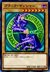
召唤怪兽的场合就是这种形式。可以攻击对方玩家或怪兽。
- 里侧守备表示
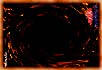
盖放怪兽的场合就是这种形式。在此状态下，一般不可使用怪兽效果。
- 表侧守备表示
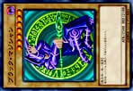
里侧守备表示的怪兽被对方怪兽攻击时，反转后就变成这种表示形式。此外，用卡效果以守备表示对怪兽进行特殊召唤等场合也会是这种表示形式。

#### 变更表示形式

在自己回合的主要阶段，可以变更怪兽的表示形式。变更表示形式需要遵循以下规则。
- 1只怪兽在1个回合中只能变更表示形式1次。
- 被召唤·特殊召唤来的怪兽在该回合中不可变更表示形式。
- 进行攻击的怪兽在主要阶段2中不可变更表示形式。

#### 变更表示形式的例子

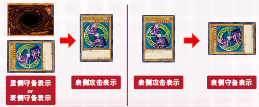

### 关于怪兽的效果

效果怪兽的卡上有写效果的内容和使用方法。
根据处理方法，效果主要分为以下4种类型，其中也存在具备这4种类型之外的特殊效果的怪兽。

- 永续效果
- 起动效果
- 诱发效果
- 诱发即时效果

#### 永续效果

只要怪兽在场上是表侧表示，效果就会持续。
该效果的特点在于，不存在发动时机，从怪兽以表侧表示出现在场上的时点开始效果就直接适用，一旦怪兽消失，效果也随之即刻消失。
要有效活用该效果，需要设法使该卡在战斗等中不会被迅速破坏。

> **例** 只要这张卡在怪兽区域存在，～。

#### 起动效果

可以宣告发动进行使用的效果。该效果一般只能在自己的主要阶段发动。有一些卡在发动效果时就必须进行丢弃手卡或解放等步骤。
因为这种效果自己发动的时机是固定的，所以便于组合到组合技攻击中去。

> **例** 自己主要阶段才能发动。～。
> 把这张卡解放才能发动。～。

#### 诱发效果

在“这张卡召唤成功时”、“这张卡反转的场合”等该怪兽卡所定的时机进行发动的效果。
容易被对方提前发觉，所以也容易让对方提前准备好应对策略，但可以用其他卡的效果或根据自己的游戏发挥引出其发动条件，在想发动的时点进行发动。

> **例** 这张卡召唤成功时才能发动。～。
> 这张卡反转的场合，～。

#### 诱发即时效果

虽然使用时点有所限制，但可以在对方回合中任意发动的特殊效果。该效果虽然是怪兽效果，但咒文速度设定为2。
像陷阱卡一样，卡的存在很难被察觉，可以给对方以预料之外的效果。

> **例** 这个效果在对方回合也能发动。

- 关于记载于怪兽卡上的能力名
一部分怪兽卡上会在种族旁边记载能力的名称。
下边的“[光道猎犬 雷光](https://ygocdb.com/card/21502796)”上记载有名为“反转”的能力，除此之外，还有些怪兽卡上记载有“同盟”等能力名。关于该能力的内容也会记载在卡的文本中。

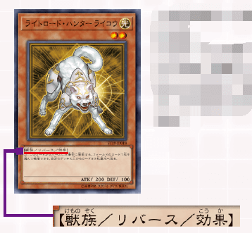

> 光道猎犬 雷光
> [怪兽|效果|反转] 兽/光
> [★2] 200/100
> ①：这张卡反转的场合发动。可以选场上1张卡破坏。从自己卡组上面把3张卡送去墓地。
> **（不在408环境卡池内）**

### 各种怪兽

#### 融合怪兽

融合怪兽是卡边缘为紫色的怪兽卡。
是使用“[融合](https://ygocdb.com/card/24094653)”魔法卡被呼叫出的怪兽。因为是用魔法卡的效果呼叫出来的，所以好处是不仅可以使用场上怪兽，还可以使用手卡中的怪兽。

> 融合
> [魔法]
> ①：自己的手卡·场上的怪兽作为融合素材，把1只融合怪兽融合召唤。

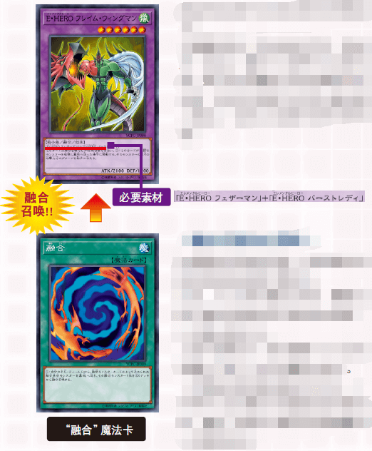

- 融合召唤的必需品
如果要进行融合召唤，需要事先将融合怪兽放进额外卡组中。
此外，为了进行融合召唤，需要记载于融合怪兽的作为素材的怪兽，以及融合魔法卡。
上面卡的场合，表示需要“[元素英雄 羽翼侠](https://ygocdb.com/card/21844576)”和“[元素英雄 爆热女郎](https://ygocdb.com/card/58932615)”。（所需素材根据怪兽有所不同。）将可作为该融合怪兽素材的怪兽和“融合”魔法卡按照所需数量放入主卡组中。

> 元素英雄 羽翼侠
> [怪兽|通常] 战士/风
> [★3] 1000/1000
> 拥有操纵风在天空飞舞之翼的元素英雄。以来自天空的一击羽翼击破来审判邪恶。

> 元素英雄 爆热女郎
> [怪兽|通常] 战士/炎
> [★3] 1200/800
> 操纵火焰的元素英雄一点红。红莲之炎爆热火焰将烧尽邪恶。

> 元素英雄 火焰翼侠
> [怪兽|效果|融合] 战士/风
> [★6] 2100/1200
> 「元素英雄 羽翼侠」＋「元素英雄 爆热女郎」
> 这张卡不用融合召唤不能特殊召唤。①：这张卡战斗破坏怪兽送去墓地的场合发动。给与对方那只怪兽的原本攻击力数值的伤害。

##### 融合召唤的步骤

1. 集齐将成为想要融合召唤的融合怪兽素材的怪兽和“[融合](https://ygocdb.com/card/24094653)”魔法，在自己的手卡或自己场上准备好。
将成为素材的怪兽也可以不是表侧表示。
2. 接着，在自己的主要阶段宣告发动“[融合](https://ygocdb.com/card/24094653)”魔法卡，放入魔法与陷阱区域。把将成为想要融合召唤的融合怪兽素材的怪兽从自己的手卡或自己场上送去墓地。

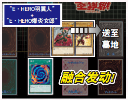

此时，可以将手卡中的怪兽或者自己场上里侧表示的怪兽等，即处于对方不知道其内容的状态的怪兽作为素材，但作为礼仪，还是得让对方确认好该怪兽是否可以作为正确的融合怪兽素材。
3. 将以被送去墓地的怪兽为素材的融合怪兽从额外卡组中取出，出到怪兽区域。最后，将用过的“[融合](https://ygocdb.com/card/24094653)”魔法卡送去墓地，融合召唤就完成了。

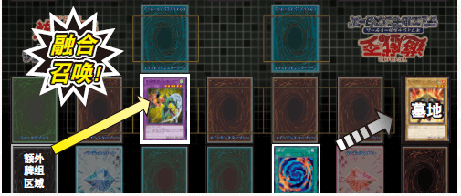

进行融合召唤的场合，融合怪兽既可以是表侧攻击表示形式，也可以是表侧守备表示形式。
进行融合召唤的场合，可以特殊召唤至主怪兽区域中的任意一处。挑选想把融合怪兽出到的区域，将融合怪兽放在该区域。

#### 仪式怪兽

仪式怪兽是卡边缘为蓝色的怪兽卡。
是用专用的仪式魔法卡呼叫出的怪兽。因为是用魔法卡的效果呼叫出来的，所以好处是不仅可以使用场上的怪兽，也可以使用手卡中的怪兽。

- 仪式召唤的必需品
为了进行仪式召唤，需要把与仪式怪兽相对应的仪式魔法卡放入主卡组中。
**需要注意的是，与融合怪兽不同，这不是放入额外卡组的怪兽。此外，在进行仪式召唤时，不需要将成为素材的特定怪兽。在记载于仪式魔法卡的条件下，解放怪兽。**
下边卡的场合，需要从手卡·自己场上解放等级总数在8以上的怪兽。

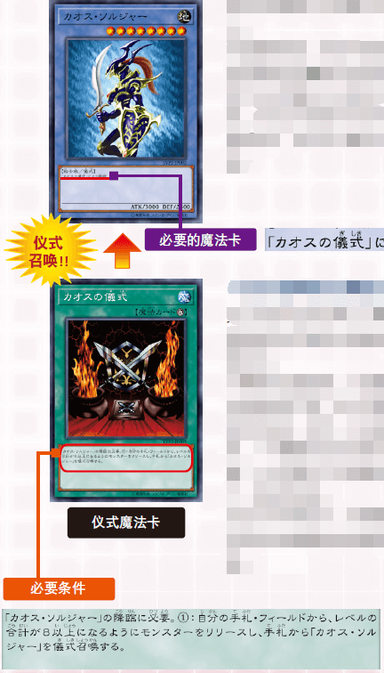

> 混沌战士
> [怪兽|仪式] 战士/地
> [★8] 3000/2500
> 「混沌的仪式」降临。

> 混沌的仪式
> [魔法|仪式]
> 「混沌战士」的降临必需。①：从自己的手卡·场上把等级合计直到8以上的怪兽解放，从手卡把「混沌战士」仪式召唤。

##### 仪式召唤的步骤

1. 将想要仪式召唤的仪式怪兽和对应的仪式魔法卡集齐，在自己手卡中准备好。
此外，需要在记载于仪式魔法卡的条件下解放怪兽，需要将用于解放的怪兽在手卡或自己场上准备好。
2. 接下来，在自己的主要阶段宣告发动仪式魔法卡，放在魔法与陷阱区域。根据记载于仪式魔法卡的条件，将怪兽从自己的手卡或自己场上解放。
此时，可以将手卡中的怪兽、自己场上里侧表示的怪兽等，即处于对方不知道其内容的状态的怪兽解放，但作为礼仪，还是得让对方确认好解放的仪式怪兽等级是否符合。

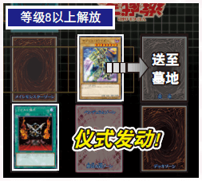

3. 把手卡中与已使用的仪式魔法卡相对应的仪式怪兽出到主怪兽区域。最后，将用过的仪式魔法卡送去墓地，仪式召唤就完成了。

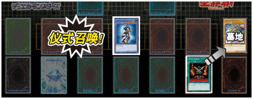

进行仪式召唤的场合，仪式怪兽既可以是表侧攻击表示形式，也可以是表侧守备表示形式。

### 关于战斗阶段的详细规则

战斗阶段指的是，使用场上怪兽进行战斗的阶段。该阶段还细分为“步骤”，依照定好的步骤推进。
战斗阶段不是必须进行的阶段。即使是在场上有怪兽的场合，也可以根据玩家的判断不进行战斗阶段，直接进入结束阶段。

#### 战斗阶段的流程

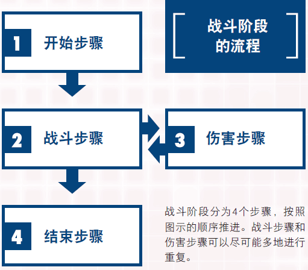

1. 开始步骤
这是为进入战斗阶段进行宣告的步骤。回合玩家要进入战斗阶段的场合，就要宣告“即将进入
战斗阶段”。
不过，只有先攻玩家的第1个回合中按照规则不可进行战斗阶段。从第2个回合的后攻玩家开始可以进行。
2. 战斗步骤
从自己场上的表侧攻击表示的怪兽中，挑选1只想使之攻击的怪兽和1只作为攻击目标的对方怪兽，宣告攻击。在没有对方怪兽的状況下，可以直接攻击对方玩家。宣告结束后就转到伤害步骤。伤害步骤结束后再次回到战斗步骤，以上步骤可尽可能多地重复。不过，一般1只怪兽只能进行1次攻击。
3. 伤害步骤
这是计算伤害，导出战斗结果的步骤。伤害步骤结束后再次回到战斗步骤。
4. 结束步骤
重复战斗步骤和伤害步骤，想使之攻击的怪兽用完之后，就进入结束步骤。向对手宣告“战斗阶段结束”，战斗阶段就结束了。

- 战斗步骤的“卷回”
在战斗步骤中，有可能出现宣告攻击怪兽和攻击目标怪兽后，因卡效果等攻击目标怪兽消失、新的对方怪兽出现的场合。
此时会发生“卷回”。回合玩家可以重新选择新的攻击目标。虽然也可以取消怪兽的攻击，但在这种场合，该回合中无法以同一只怪兽再次攻击，这一点请务必注意。

#### 战斗处理时（伤害步骤）的注意点

在优先进行伤害计算处理的伤害步骤中，存在高难度的发动限制，效果处理的时机也与通常不同，请务必注意。

- 卡的发动限制
在伤害步骤中，除具备增减怪兽的攻击力·守备力的效果的卡，以及反击陷阱之外，其他都不可发动。此外，这些卡只能在伤害步骤开始后、开始计算伤害之间的时间段发动。
- 攻击里侧表示的怪兽
攻击里侧守备表示的怪兽的场合，会在伤害步骤反转该怪兽，变成表侧守备表示。之后，确认该怪兽的守备力，转入伤害计算。
- 反转的场合发动的怪兽效果
被攻击的里侧守备表示的怪兽，如果具备可以在“该卡反转的场合”进行发动的效果，其效果的发动和处理将在伤害计算之后进行。此时，在以场上怪兽为对象发动效果的场合，不可将因伤害计算确定破坏的怪兽为对象。

### 关于魔法·陷阱卡等卡的效果的使用方法

以下将对各种卡的使用方法进行详细说明。

#### 魔法卡的发动方法

从手卡发动魔法卡的场合先暂时放在魔法与陷阱区域。在魔法与陷阱卡区域已经有5张卡的状況下，就不能从手卡发动新的魔法卡。
只要是场地魔法，那么即便场地区域内有自己发动或盖放的卡，也可以把旧卡送去墓地，并发动·盖放新的场地魔法卡。
此外，自己和对方可以各自发动1张场地魔法，其效果有只适用于自己的，也有同时适用于对方的。

#### 关于发动时机未被记载的卡效果

魔法·陷阱卡和效果怪兽的多数效果上大多记载有发动时机，但也存在一些卡，随时都可以发动。
（主要可以在速攻魔法、陷阱卡、怪兽的诱发即时效果等看到。）
此外，关于这些卡，其中存在很多不可在伤害步骤发动的卡。这些卡的效果不仅在自己的回合，也可以在对方回合发动，所以不可以无视对方卡的发动和处理，自己随意进行发动。
在“游戏王官方卡片游戏决斗怪兽”中，为顺利解决这些处理，定有名为“连锁”和“咒文速度”的规则。

### 连锁与咒文速度

#### 何为连锁？

“连锁”指的是，在以顺利解决魔法&陷阱卡等应对问题为目的的系统内，对应1张卡的发动去发动
其他卡的行为。
卡发动效果时，对方玩家针对此就一定会得到连锁机会。此处要注意的是，不要在未确认对方是
否要连锁的场合就直接进行处理。对方进行连锁的场合，自己也可以进行连锁。对方未进行
连锁的场合，也可以自己连锁自己的卡。
如此就可以尽可能多地进行连锁，双方不再进行连锁时，最后就从被连锁发动的卡开始按顺序进
行效果处理。

#### 咒文速度

“咒文速度”指的是卡的效果速度。与连锁相关、且已发动的卡快于对应卡的咒文速度的场合，
不可发动连锁。
大致来说，反击陷阱最快，接下来是速攻魔法·陷阱卡，最慢的是效果怪兽·魔法卡的效果。

#### 连锁的结构

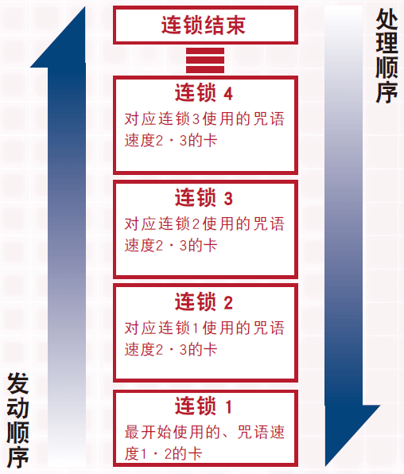

熟练掌握连锁后，最开始发动的卡作为“连锁1”，每一次连锁发动就以连锁2,3……的形式不断积累连锁块。
连锁发动结束后就进入效果处理，从最后发动的连锁开始按顺序进行效果处理。

#### 咒文速度一览

魔法、陷阱、效果怪兽的效果中速度已被设定好。存在1至3的咒文速度，如果没有对应卡以上的速度，就不可进行连锁发动，这一点请务必注意。

- 咒文速度1
  - 通常魔法　
  - 装备魔法
  - 场地魔法
  - 永续魔法
  - 仪式魔法
  - 效果怪兽

这是咒文速度中最慢、对其他任何发动都不可主动进行连锁发动的卡。因此，一般来说不可能积累到连锁2以上。

- 咒文速度2
  - 速攻魔法
  - 通常陷阱
  - 永续陷阱
  - 效果怪兽（诱发即时效果）

这是对于咒文速度1和咒文速度2可以进行连锁的组。包括不选择时机就可发动的卡，以及在对方回合也可发动的卡等。

- 咒文速度3
  - 反击陷阱

对任何速度都可进行连锁、咒文速度最快的卡。只有咒文速度同为3者可以与之对应。

#### 连锁例

“例”对应玩家A使用的“[旋风](https://ygocdb.com/card/5318639)”，玩家就发动埋伏的“[魔法干扰阵](https://ygocdb.com/card/77414722)”。接下来玩家A继续对应，发动“[盗贼的七道具](https://ygocdb.com/card/3819470)”。

> 旋风
> [魔法|速攻]
> ①：以场上1张魔法·陷阱卡为对象才能发动。那张卡破坏。

> 魔法干扰阵
> [陷阱|反击]
> ①：魔法卡发动时，丢弃1张手卡才能发动。那个发动无效并破坏。

> 盗贼的七道具
> [陷阱|反击]
> ①：陷阱卡发动时，支付1000基本分才能发动。那个发动无效并破坏。

|           | 在这种场合，连锁就如下进行积累。                    |
| --------- | ----------------------------------------------------- |
| **连锁3** | “[盗贼的七道具](https://ygocdb.com/card/3819470)” 咒文速度3 将“[魔法干扰阵](https://ygocdb.com/card/77414722)”的发动无效化 |
| **连锁2** | “[魔法干扰阵](https://ygocdb.com/card/77414722)” 咒文速度3 将“[旋风](https://ygocdb.com/card/5318639)”的发动无效化         |
| **连锁1** | “[旋风](https://ygocdb.com/card/5318639)” 咒文速度2 破坏场上的1张魔法·陷阱卡         |

首先，要在一开始处理连锁3的“[盗贼的七道具](https://ygocdb.com/card/3819470)”，将“[魔法干扰阵](https://ygocdb.com/card/77414722)”的发动无效化。
接下来要处理连锁2的“[魔法干扰阵](https://ygocdb.com/card/77414722)”，用刚才的“[盗贼的七道具](https://ygocdb.com/card/3819470)”效果使之一直保持不发动的状态。
于是，通过“[魔法干扰阵](https://ygocdb.com/card/77414722)”的效果本应被无效化的连锁1的“[旋风](https://ygocdb.com/card/5318639)”的效果被顺利处理，正如最开始的目的一样，场上的1张魔法·陷阱卡被破坏。

## 上级编 了解面向大赛的规则

### 关于对战方法和胜利条件

#### 对战方法

在官方大赛和活动中，有可能采用通过3次决斗决定胜者的方法。
这种3次定胜负的方法称为“比赛”。
在“比赛”过程中，第2次决斗以后的先攻·后攻选择权属于前一次决斗中的败者。
在“比赛”过程中先胜2次的玩家为胜者。
1胜2平局的场合，1胜的为胜者。
此外，1胜1败1平局、3平局的场合，该次“比赛”就为平局。

#### 决斗的胜利条件

先将对方的基本分降为0的就获胜，但也可能根据其他条件决定决斗胜负。
- 对方卡组为0张、必须抽卡时却抽不了的场合（对方卡组的剩余张数变为0张的时点不算胜利。）
- 根据各种卡的效果获胜
> **例** 在自己手卡中集齐“[被封印的艾克佐迪亚](https://ygocdb.com/card/33396948)”、“[被封印者的右足](https://ygocdb.com/card/8124921)”、“[被封印者的左足](https://ygocdb.com/card/44519536)”、“[被封印者的右腕](https://ygocdb.com/card/70903634)”、“[被封印者的左腕](https://ygocdb.com/card/7902349)”时，就获得决斗的胜利。

>被封印的艾克佐迪亚
[怪兽|效果] 魔法师/暗
[★3] 1000/1000
这张卡和「被封印者的右腕」「被封印者的左腕」「被封印者的右足」「被封印者的左足」在手卡全部齐集时，自己决斗胜利。

>被封印者的右足
[怪兽|通常] 魔法师/暗
[★1] 200/300
被封印的右足。假若解开封印，能得无限之力。

> 被封印者的左足
[怪兽|通常] 魔法师/暗
[★1] 200/300
被封印的左足。假若解开封印，能得无限之力。

> 被封印者的右腕
[怪兽|通常] 魔法师/暗
[★1] 200/300
被封印的右腕。假若解开封印，能得无限之力。

> 被封印者的左腕
[怪兽|通常] 魔法师/暗
[★1] 200/300
被封印的左腕。假若解开封印，能得无限之力。

### 根据大赛和活动情况所需要的东西

#### 副卡组

副卡组指的是用于卡组调整的预备卡。虽然不能在决斗中使用，但在3次定胜负的“比赛”中，可以在决斗与决斗的间隙中根据战略替换卡组·额外卡组中的卡。替换副卡组之前和之后的张数必须相同。使用副卡组时的注意点如下。
- 副卡组的张数在15张以下
- 与在卡组·额外卡组中使用的卡同名的卡被使用的场合，加上卡组·额外卡组，同名的卡最多3张。

#### 根据卡的效果处理所需要的东西

- “硬币”
有一些卡可以使用硬币进行效果判定。
- “骰子”
和硬币一样，有一些卡可以使用骰子进行效果判定。
本游戏使用的是数值从1到6的6面骰子。
- “指示物”
根据卡的效果，用于计算回合或能力上升等的点数的记号。
- “怪兽衍生物”
这是根据卡的效果可以作为怪兽替代品使用的东西。
尽量使用攻击表示·守备表示简明易懂的怪兽衍生物。

> 使用硬币或骰子等场合，要在对战前事先准备好。

### 其他规则（面向上级者）

#### 禁止·限制卡

一般来说，能放进卡组（包括额外卡组·副卡组）的同名卡的张数最多一共3张，但在官方大赛等进行的官方决斗中，设置了根据大赛形式制定的、被称为“限制规则”的规则。可能会限制放进卡组的卡的张数。
限制分为3种，设定在3种范围之内的卡被设定了可放进卡组的同名卡的最多张数。

- “禁止卡”
已被设定的卡1张都不能使用。
- “限制卡”
同名卡最多1张。
- “准备限制卡”
同名卡最多2张。
限制卡的列表会发布在“游戏王官方卡片游戏决斗怪兽官方网站”上，并随时更新。如果要参加大赛，请提前确认好，并调整卡组。

> **编者注** 游戏王408环境的禁止·限制卡请看[此处](../../Cardpool%20Banlist/BanList.html)（无法跳转返回本页）。

#### 怪兽衍生物

怪物衍生物指的是卡的效果产生的怪兽。因为不是卡，所以不放入卡组，被破坏后也不会去墓地而是直接消灭。消灭的怪兽衍生物会从决斗中除去，但不被包含在根据卡效果被除外的卡。实际出到场上时，请将硬币或外卡套等（必须是可以攻击·守备表示的）作为衍生物出到主怪兽区域。衍生物作为主怪兽区域5张限制中的1张进行计算。
此外，表示形式仅有表侧攻击表示和表侧守备表示。衍生物不可里侧表示。

#### 公开信息

“手卡张数”、“墓地卡”、“现在的基本分”等为公开信息，可以双方互相随时确认。被问及手卡张数和基本分的玩家必须告诉对方正确数值。
此外，关于墓地的信息，即便是对方的墓地也可拿来进行确认，但要遵守事前和对方打招呼的礼仪。还有，确认墓地时，卡的顺序不可改变。

#### 同时发动多张卡的场合

咒文速度为1的诱发效果在相同时机发动的场合，可以特殊对待，用连锁处理解决效果。首先从回合玩家的效果开始连锁。只有一个的场合那就算连锁1，存在多个的场合就由回合玩家进行选择自己的效果制作连锁。之后对方玩家将该连锁与自己的效果重叠。也就是说，从对方玩家的效果开始进行处理。

#### 关于效果发动和基本的连锁方法

发动效果（卡）的场合，发动该效果的玩家必须确认是否与对方玩家连锁。在这个时点不对发动的效果进行处理。双方都“不连锁”的场合，就开始效果处理。并且，因为不是“怪兽的各种召唤”、“宣告各阶段的开始和结束”等效果（卡）的发动，不可以对此连锁。

#### 关于攻击力同为0的怪兽之间的战斗

具备相同攻击力、以攻击表示存在的双方怪兽在进行战斗的场合，双方的怪兽一般都会被战斗破坏，而以攻击表示存在、攻击力为0的怪兽们在进行战斗时，因为都不具备攻击力，双方怪兽都不会被破坏，可以留在场上。

#### 双方同时行动的场合

如“双方各抽1张卡”所说的那样，双方要同时进行相同效果处理的场合，回合玩家先进行效果处理。在上述效果中，回合玩家先抽1张卡之后，另一方的玩家再抽卡。

#### 规则和效果相矛盾的场合

基本规则和卡的效果相矛盾的场合，一般优先各卡的效果。比如按照基本规则，1个回合怪兽只可攻击1次，但使用卡的效果可以进行2次攻击。

#### 何为记载于旧卡的“祭品召唤”

指的是本书开设的“大师规则”中的“上级召唤”。记载于卡上的“祭品召唤”作为规则中的“上级召唤”推进游戏。

#### 确认过卡组卡的场合的处理

进行像“从卡组把1只战士族怪兽加入手卡”这样的效果处理的场合，先将卡组内容全部确认后再进行处理。在这种场合，即便卡文本中没有记载，处理后也要对卡组进行洗切。同时，像“卡组最上面的卡翻开”、“回到卡组最下面”这样的卡效果处理并不是要确认卡组的全部内容，处理后不对卡组进行洗切。

#### 回合的计算方法

计算回合时，将各自的回合都作为1个回合进行计算。这样，自己的回合结束，对方的回合也结束的场合，就算已经过了2个回合。有些卡上有“计算3个对方的回合”等记载，在这种场合，就只计算对方的回合数。

#### 关于将卡回到手卡或卡组的效果的处理

发动“把卡回到持有者手卡”、“把卡回到持有者卡组”的效果，该效果适用于融合怪兽的场合，就不回到手卡或卡组，而是回到额外卡组。融合怪兽不回到手卡或卡组。

#### “关于〇〇指示物”

这指的是根据特定的卡效果等被指定的放在卡上的记号。指示物有很多种类，根据需要各种指示物的卡的效果，可适用于各类效果。此外，一般来说各种指示物本身是没有效果的。

#### 关于里侧表示的卡（被盖放的卡）

在场上以里侧表示存在的卡（被盖放的卡）的内容没有公开信息，不可向对方玩家确认。存在于怪兽区域的场合，会判别为怪兽，但除此之外的具体信息（怪兽卡的种类·卡名·种族·属性·等级·攻击力等）处于不可判别状态。被盖放于魔法与陷阱区域的场合，就是魔法卡或陷阱卡，但还是不能确认具体信息。
在这些场合，需要特定卡名的效果不可适用，如果是被盖放的怪兽的场合，无法对装备魔法进行装备，以及需要种族或属性、攻击力等卡的具体信息的效果也不可适用。

#### 关于怪兽的特殊召唤

怪兽的特殊召唤大致可分为2种。1种是特殊召唤怪兽的特殊召唤。这种是依照特殊步骤进行的，不伴随效果的发动。以及召唤条件有规定的效果怪兽。
此外，最新的文本中，特殊召唤怪兽记载有“○○族/特殊召唤/效果”。
另一种是根据卡效果进行的特殊召唤。和上述的特殊召唤不同，伴随着魔法·陷阱或效果怪兽的效果发动会进行处理。包括融合召唤、仪式召唤，以及具备特殊召唤怪兽效果的魔法·陷阱·效果怪兽的效果。
一般来说，如果是手卡或卡组中的特殊召唤怪兽、未经规定方法召唤而被送去墓地的特殊召唤怪兽，不可用这种方法进行特殊召唤。
还有，“电子龙”等一部分效果怪兽中，也存在一些特别的怪兽，像特殊召唤怪兽的特殊召唤一样，它们具备在不发动效果的状态下进行处理并被特殊召唤的效果。

#### 回合玩家的优先权

推进回合的回合玩家都掌握着在各阶段和步骤的先行发动卡的权利。这称为回合玩家的“优先权”。
只要回合玩家拥有优先权，那么对方玩家除了主动发动的诱发效果之外，不可以先发动卡。在“获得优先权发动卡的场合”和“放弃优先权的场合”，优先权自动转移到对方玩家手中。推进阶段或步骤之前必须先放弃优先权。
在决斗中严格推行这项规则的话，每次在阶段或步骤结束前都必须宣告放弃优先权，确认对方的卡的使用情况。不过，在实际决斗过程中为了顺畅推进游戏，宣告阶段或步骤的结束也包含了放弃优先权的意思。
如此，宣告阶段等的结束时，对方玩家可以说“那么在结束前我要发动这张卡”，并使用卡，这就相当于回合玩家放弃了优先权，对方玩家获得优先权了。

> 发动卡的优先权在于回合玩家
> 卡发动后，在宣告步骤或回合结束的场合，优先权转移到对方玩家手里

#### 关于结束阶段诱发效果等的处理

存在“结束阶段必须进行的效果处理”、“可以在结束阶段发动的怪兽的诱发效果”的场合，回合玩家对这些效果可以优先进行发动·处理。
因为这些效果的处理阶段是结束阶段，所以要各自一一进行解决。在这种场合，在该结束阶段必须处理的种种效果不会采用连锁处理。
对方玩家也一样，存在在结束阶段必须进行的效果处理、怪兽的诱发效果的场合，不会把各种效果放在连锁上进行处理，而是要各自一一处理。此时，即便双方都必须进行效果处理的场合，因为回合玩家有优先权，可以从回合玩家的效果开始处理。在此时点回合玩家必须进行的效果处理都已完成的场合，那就由对方玩家进行效果处理。
此外，回合玩家一一进行效果处理，在1个效果处理完成的时点，在暂时放弃优先权的场合，对方玩家可进行效果处理。

#### 关于“Yu-Gi-Oh! Trading Card Game”系列

用英语等日语之外的语言表记的“Yu-Gi-Oh! Trading Card Game”系列可以和日语表记的卡混合进行游戏。
不过，在大赛等官方决斗的场合有可能禁止使用。需要事先确认大赛规则。此外，“Yu-Gi-Oh! Trading Card Game”系列和日语表记的卡混合使用的场合，卡背面的设计有所不同，所以一起使用时要装载看不到背面的卡套。
还有，使用日语表记之外的卡的场合，为了正确进行卡的效果处理，提前告诉对战对方正确的文本。
卡的日语名称和英语名称可以在“游戏王官方卡片游戏决斗怪兽卡数据库”（https://www.db.yugioh-card.com/yugiohdb/）进行确认。

> **编者注** 408环境不限制玩家使用的卡片语言种类，甚至Rush Duel里面的同名卡都拿来使用，资料按照OCG版本的卡处理即可。此时要解决的就是用卡套隐藏卡背避免“做记号”的问题。

#### 魔法·陷阱卡的“卡发动”和“效果发动”

从手卡将魔法卡表侧放在魔法与陷阱区域，或被盖放的魔法·陷阱卡从反面翻到表侧进行发动就称为“卡发动”。像“[魔法干扰阵](https://ygocdb.com/card/77414722)”那样将卡发动无效化的反击陷阱卡在此时将会发动。此外，永续魔法、永续陷阱卡与此不同，在以表侧表示的形式存在时会具备可发动的效果，也存在被破坏并被送去墓地时发动效果的魔法卡。这称作“效果发动”，与上述的“卡发动”相区别。

#### 关于伤害步骤的详情

在伤害步骤会进行各种处理，包括计算战斗伤害、因战斗产生的怪兽破坏、因战斗发动的效果等。为了顺利进行这些处理，伤害步骤进一步分为5个阶段推进。

> **编者注** 此处“阶段”并非每回合的6个“阶段”，日语原文用词是“**段階**”，而每回合的6个是“**フェイス**”。

1. 伤害步骤开始时
伤害步骤开始。（攻击里侧表示怪兽的场合，在该时点该怪兽不会变成表侧表示。）
- 关于可以发动的卡等
一般来说，除“伤害步骤时”可发动的效果和增减怪兽的攻击力·守备力的效果（“[收缩](https://ygocdb.com/card/55713623)”、“[欧尼斯特](https://ygocdb.com/card/37742478)”等）以及反击陷阱之外都不可发动。而“[一刀两断侍](https://ygocdb.com/card/16222645)”、“[谜之剑士 LV2](https://ygocdb.com/card/47507260)”、“[正义盟军 灾亡虫](https://ygocdb.com/card/26593852)”等一部分卡的效果会在该时机发动，进行处理。

> 收缩
> [魔法|速攻]
> ①：以场上1只表侧表示怪兽为对象才能发动。那只怪兽的原本攻击力直到回合结束时变成一半。

> 欧尼斯特
> [怪兽|效果] 天使/光
> [★4] 1100/1900
> ①：自己主要阶段才能发动。场上的表侧表示的这张卡回到手卡。
> ②：自己的光属性怪兽进行战斗的从伤害步骤开始时到伤害计算前，把这张卡从手卡送去墓地才能发动。那只怪兽的攻击力直到回合结束时上升进行战斗的对方怪兽的攻击力数值。
> **（不在408环境卡池内）**

> 一刀两断侍
> [怪兽|效果] 战士/风
> [★2] 500/800
> 这张卡攻击里侧守备表示的怪兽的场合，不进行伤害计算，里侧守备表示的怪兽以本来的里侧守备形式直接破坏。

> 谜之剑士 LV2
> [怪兽|效果] 战士/地
> [★2] 900/0
> 攻击里侧守备表示怪兽的场合，不进行伤害计算，那只怪兽以里侧守备表示的状态直接破坏。这张卡战斗破坏怪兽的回合的结束阶段，可以把这张卡送去墓地，从手卡·卡组特殊召唤1只「谜之剑士 LV4」。

> 正义盟军 灾亡虫
> [怪兽|效果|同调] 机械/暗
> [★5] 2200/1200
> 调整＋调整以外的怪兽1只以上
> ①：这张卡和暗属性以外的表侧表示怪兽进行战斗的伤害步骤开始时发动。那只怪兽破坏。
> **（不在408环境卡池内）**

2. 伤害计算前
攻击里侧表示怪兽的场合，这里将该怪兽反转，进行表侧表示。（此外，该已进行表侧表示的怪兽的“该卡反转的场合”的效果不在此处进行处理。会在“伤害计算后”发动，并进行处理。）
双方都完成卡发动和效果处理后，就进入伤害计算。
- 关于可以发动的卡等
里侧表示怪兽变为表侧之后，可以发动怪兽的效果和速攻魔法·陷阱卡等的效果，但一般来说，除“伤害步骤时”、“伤害计算前”可以发动的效果和增减怪兽的攻击力·守备力的效果（“[收缩](https://ygocdb.com/card/55713623)”、“[欧尼斯特](https://ygocdb.com/card/37742478)”等）以及反击陷阱之外都不可发动。“[光道武僧 艾琳](https://ygocdb.com/card/44178886)”“[钻头机人](https://ygocdb.com/card/71218746)”等一部分卡的效果会在该时点发动，并进行处理。

> 光道武僧 艾琳
> [怪兽|效果] 战士/光
> [★4] 1600/1000
> ①：这张卡向守备表示怪兽攻击的伤害计算前发动。那只怪兽回到持有者卡组。
> ②：自己结束阶段发动。从自己卡组上面把3张卡送去墓地。
> **（不在408环境卡池内）**

> 钻头机人
> [怪兽|效果] 机械/地
> [★4] 1600/1600
> 这张卡攻击守备表示怪兽的场合，不进行伤害计算，被攻击怪兽直接破坏。

3. 伤害计算时
进入实际的伤害计算。根据该战斗的结果，决定战斗伤害造成的基本分减少和怪兽的破坏。（在该时点，战斗造成的破坏已被决定的怪兽不会被送去墓地。会在“伤害步骤结束时”被送去墓地。）此外，一部分卡在该时机也可以发动，但一般来说，在进行实际的伤害计算之前，完成发动及处理后，会进行伤害计算。
- 关于可以发动的卡等
一般来说，除“伤害计算时”可发动的效果和反击陷阱之外不可发动。“[栗子球](https://ygocdb.com/card/40640057)”、“[注射天使 莉莉](https://ygocdb.com/card/79575620)”、“[护卫防壁](https://ygocdb.com/card/24268052)”等一部分卡的效果会在该时机发动，并进行处理。

> 栗子球
> [怪兽|效果] 恶魔/暗
> [★1] 300/200
> ①：对方怪兽的攻击要让自己受到战斗伤害的伤害计算时，把这张卡从手卡丢弃才能发动。那次战斗发生的对自己的战斗伤害变成0。

> 注射天使 莉莉
> [怪兽|效果] 魔法师/地
> [★3] 400/1500
> ①：这张卡进行战斗的伤害计算时1次，支付2000基本分才能发动。这张卡的攻击力只在那次伤害计算时上升3000。

> 护卫防壁
> [陷阱]
> 对方回合的战斗伤害计算时才能发动。那次战斗发生的对自己的战斗伤害变成0，从自己卡组抽1张卡。
> **（不在408环境卡池内）**

4. 伤害计算后
处理因进行战斗发动的各种卡的效果。“伤害计算前”为里侧表示的怪兽变为表侧的场合，该怪兽的“该卡反转的场合”的效果会在此处进行处理。
- 关于可以发动的卡等
“给与战斗伤害时”的效果（“[天空骑士 珀耳修斯](https://ygocdb.com/card/18036057)”等）
“受到战斗伤害时”的效果（“[冥府之使者 格斯](https://ygocdb.com/card/44330098)”等）
“伤害计算后”的效果（“[红莲魔龙](https://ygocdb.com/card/70902743)”等）
“进行战斗时”的效果（“[异次元的战士](https://ygocdb.com/card/37043180)”、“[异次元的女战士](https://ygocdb.com/card/7572887)”等）
由于……所代表的战斗的进行而满足发动条件的卡的效果的发动和处理需要连锁后进行处理。根据连锁组合方式的相关规则，从回合玩家的效果开始按顺序组建连锁。一般来说，其他的卡除反击陷阱之外不可发动。

> 天空骑士 珀耳修斯
> [怪兽|效果] 天使/光
> [★5] 1900/1400
> ①：这张卡向守备表示怪兽攻击的场合，给与攻击力超过那个守备力的数值的战斗伤害。
> ②：这张卡给与对方战斗伤害的场合发动。自己从卡组抽1张。

> 冥府之使者 格斯
> [怪兽|效果] 恶魔/暗
> [★7] 2700/2500
> 自己场上没有卡存在的场合，因对方控制的卡受到伤害时，这张卡可以从手卡特殊召唤。这个方法特殊召唤成功时，把受到的伤害种类的以下效果发动。
> ●战斗伤害的场合，在自己场上把1只「冥府之使者 凯恩衍生物」（天使族·光·7星·攻/守?）特殊召唤。这衍生物的攻击力·守备力变成和这个时候受到的战斗伤害相同的数值。
> ●卡的效果伤害的场合，给与对方基本分和受到的伤害相同的伤害。
> **（不在408环境卡池内）**

> 红莲魔龙
> [怪兽|效果|同调] 龙/暗
> [★8] 3000/2000
> 调整＋调整以外的怪兽1只以上
> ①：这张卡向对方的守备表示怪兽进行攻击的伤害计算后发动。对方场上的守备表示怪兽全部破坏。
> ②：自己结束阶段发动。这张卡在场上表侧表示存在的场合，这个回合没有攻击宣言的自己场上的其他怪兽全部破坏。
> **（不在408环境卡池内）**

> 异次元的战士
> [怪兽|效果] 战士/地
> [★4] 1200/1000
> ①：这张卡和怪兽进行战斗的伤害计算后发动。那些进行战斗的各自怪兽除外。

> 异次元的女战士
> [怪兽|效果] 战士/光
> [★4] 1500/1600
> ①：这张卡和对方怪兽进行战斗的伤害计算后才能发动。那些进行战斗的各自怪兽除外。

5. 伤害步骤结束时
因战斗破坏已确定的怪兽被送去墓地，伤害步骤结束。
- 关于可以发动的卡等
“该卡因战斗被破坏并被送去墓地时”的效果（“[巨大老鼠](https://ygocdb.com/card/97017120)”等）
由于在……所代表的战斗中怪兽被破坏并被送去墓地从而满足了发动条件的卡的效果或处理会在连锁上进行处理。根据组建连锁的规则，从回合玩家的效果按顺序一步一步组建连锁。一般来说，其他的卡除反击陷阱之外不可发动。

> 巨大老鼠
> [怪兽|效果] 兽/地
> [★4] 1400/1450
> ①：这张卡被战斗破坏送去墓地时才能发动。从卡组把1只攻击力1500以下的地属性怪兽攻击表示特殊召唤。

### 规则用语辞典（面向上级者）

#### 解放（做祭品/作为祭品）

发动卡效果或对怪兽进行上级召唤时作为条件的一个步骤，一般指的是将怪兽卡送去墓地。发动卡的效果——“可解放并发动1只场上的怪兽”等场合，不进行卡的效果处理，而是必须作为代价进行解放，所以要在宣告卡发动之前进行。用这个方法送去墓地的怪兽不会被“破坏”。此外，一般能解放的只有作为怪兽的卡。用某些方法放在魔法与陷阱区域的怪兽卡会作为魔法卡，不可解放。

> **编者注** “做祭品/作为祭品”的不同是早期翻译所致，日文原文均为“生け贄に捧げる”。

#### 卡的效果

指的是记载于效果怪兽·魔法·陷阱卡上的卡的使用方法。细致的卡文本中会以“①〜〜。”、“②〜〜。”的形式记载，每张卡的效果都清晰易懂。
有一些卡，其作为发动效果的条件的步骤或代价（丢弃手卡、支付基本分等）是固定的。为发动效果解放怪兽的行为，或因战斗破坏怪兽等不属于“卡的效果”。

#### 发动

使用于卡文本的“发动”指的是，在使用魔法·陷阱·怪兽的效果时，伴随发生连锁块的场合。想使用记载于怪兽卡上的效果的场合，或想把魔法卡出到场上使用其效果等场合，大多会变成“发动”，可以制作连锁块。（一部分卡的“发动”有固定条件或代价。）
效果被永续适用的永续魔法的效果，以及怪兽的永续效果等一些在场上只要持续以表侧表示存在就会持续被适用的效果，会一直处于被适用的状态，在这种场合就无法制作连锁块，不会变成“发动”。此外，为从手卡使用魔法卡而放在魔法与陷阱区域的场合也会变成“发动”，即便是永续魔法卡，当从手卡放到魔法与陷阱区域时，有时也可以制作连锁块来当作魔法卡的“发动”。

#### 场上的卡

表记于卡的效果的“场上的卡”一般指的是除墓地、卡组、额外卡组的决斗场上的所有卡。
此外，因卡的效果被除外的卡不包含在“场上的卡”中。

#### “会”和“可”

在卡的说明中使用了“会～”和“可～”这样的用语，其中是有差别的。“会～”是必须进行的效果，而“可～”表示的是玩家可以选择是否实行的效果。

> **编者注** 常用民间翻译不会如此用词，本处保留简体中文版小册子的说明供参考。
> “会～”的日语原文是“**～する**”，表示必做的游戏行动。
> “可～”的日语原文是“**～できる**”，表示选做的游戏行动。
> 对于民间翻译，日常只需留意“**才能发动**”“**可以**”等选做行动提示文字。

#### “时”和“的场合”

卡的效果文本中，为说明该卡可使用的时机和条件等，使用了“～时”、“～的场合”这样的用语，其中是有差别的。“～时”表示只可以在满足其处理或条件后立即使用。因此，某种效果或连锁的处理等的途中，即使满足其处理或条件，也可能无法使用该卡的效果。
“～的场合”表示满足其处理或条件就可以使用。和“～时”不同，某种效果或连锁的处理等的途中，只要满足其处理或条件，该处理结束后，就可以使用该卡的效果。

#### 盖放

将各种卡里侧出到场上就称为“盖放”。以里侧守备表示出怪兽卡也称为“盖放”。

#### 战斗伤害

战斗伤害指的是，因战斗阶段进行的怪兽战斗发生的、对玩家造成的伤害。因魔法卡等、效果产生的伤害与之有所区别。

#### 装备卡

一般指的是装备魔法卡，但根据卡的效果，陷阱卡或怪兽卡也可以像装备魔法一样进行装备。这些也包含在“装备卡”之内。

#### 装备怪兽

指的是装备上了装备卡的怪兽。该怪兽一旦被破坏，装备卡就失去了对象，会被破坏并被送去墓地。

#### 回合玩家

指的是推进回合的玩家。此外，回合玩家会主导推进该回合，在与对方相互确认的过程中，使回合得以顺畅进行。回合玩家一般可以优先对方玩家发动卡或行动。

#### 抽卡

指的是抽出自己卡组最上面的卡加入手卡。除在抽卡阶段进行的抽卡以外，也可能根据卡的效果抽卡。

#### 抽卡的计数

“每次抽卡都会～”这类效果时所适用的抽卡的计数，每1次效果就当作“抽了1次”。比如“要抽2张卡”这个效果的场合，算作抽了1次。需要注意的是，所计算的不是抽的卡的张数。“每次丢弃卡的时候”、“每次受到伤害的时候”等效果也适用同样的计数方法。

#### 破坏

指的是根据怪兽战斗或破坏卡的效果，卡被送去墓地。从场上返回手卡或卡组，或者将卡作为代价送去墓地的行为不属于“破坏”的范畴。

#### 随机

指的是无作为地选择卡。如果无法判别卡的内容，其方法就没有特别规定，但一般是让不知道卡内容的对方玩家进行挑选。

#### 洗切

指的是将卡打乱混合。洗切方法没有规定，但不可进行任何有目的的行为，包括中途看卡的内容、在选牌分卡后再进行洗切等。

#### “送去墓地”和“丢弃去墓地”

通过破坏卡并被送去墓地、丢弃手卡、解放怪兽等将卡摆放到墓地的全部行为都称为“送去墓地”。
此外，在结束阶段调整手卡张数时将卡放在墓地、通过处理“丢弃卡”的效果将手卡中的卡放在墓地等行为也包含在“送去墓地”中，但这些行为会专门称为“丢弃去墓地”以进行区别。一些效果怪兽会因为“丢弃去墓地”而发动效果。

#### 原本的攻击力（守备力）

卡的效果文本中所使用的“原本的攻击力”一般指的是，记载于怪兽卡的攻击力的数值。不包含因装备魔法卡或其他卡的效果增减的数值。此外，攻击力或守备力标有“？”的怪兽的场合，那么原本的攻击力或守备力就作为“0”。

#### 1回合1次

卡的效果文本中所使用的“1回合1次”一般指的是，“使用该卡的效果的玩家，1个回合中只可使用1次该卡的效果”。
比如对方也拥有同名卡的场合，自己已经先使用了该卡的效果，并不意味着对方就不能再使用该同名卡了。
“1回合1次”的场合，有可能在自己的回合和对方的回合，各自都能发动1次该卡的效果，但根据怪兽的起动效果等，如果是只可在自己的回合发动的卡的效果，那就表示“每次到自己的回合，就可以发动1次该卡的效果”。

#### 翻开卡

“翻开卡”这种行为一般指的是确认埋伏着的卡的真面目。“该卡反转的场合”的效果等无法发动。确认完成后，一般会返回原来的位置，再次埋伏。

#### 取（指定）对象的效果

取对象的效果指的是，选择给与效果的目标后所发动的效果。对不特定卡给与效果的场合，以及处理效果时目标被确定的效果不属于“取对象的效果”。

#### “‘○○’的效果”和“‘○○’的该效果”

有一些卡具备2个以上的效果。在卡的效果文本中，为了让阅读者清楚，是在说明该效果的哪个部分，就用“○○”的效果和“○○”的该效果这两种说法加以区分。如果是“○○”的效果，就表示具备该效果的所有卡。如果是“○○”的该效果，那么说明的就是这部分前面的文章中所记载的效果。
比如，“○○”效果1个回合只可使用1次。在这种场合，即使该“○○”卡具备2个效果，只可使用其中1个。
“○○”的该效果在1个回合只可使用1次。在这种场合，该“○○”卡如果具备2个效果，在1个回合就只可使用前面文章记载的那1个效果1次。

#### 反转

“反转”指的是里侧表示的怪兽变成表侧表示。里侧守备表示的怪兽被对方怪兽攻击从而变成表侧守备表示的场合，或是根据卡效果从里侧守备表示变为表侧表示的场合，以及根据反转召唤变成表侧攻击表示的场合都包含在内。有一些怪兽会因为“反转”而发动效果。

#### 除外（从游戏中排除·去除）

使用过的卡一般全部都会被送去墓地，但因卡效果被除外的话，就会被隔离到决斗场地外，只要不使用可适用于被除外的卡的效果，就无法再在该决斗中使用。从下一个决斗开始，被除外的卡会回到卡组进行使用。此外，从场上离开并消灭的怪兽衍生物不作为被除外的卡。

#### “～”卡、“～”怪兽

“‘～’卡”指的是“名字带有‘～’的卡”。比如在文本中有“‘青眼’卡”的字样，指的就是“名字带有‘青眼’的卡”。同样，“‘～’怪兽”指的就是“名字带有‘～’的怪兽”。

#### “通常召唤怪兽”和“特殊召唤怪兽”

通常召唤怪兽指的是，1个回合中通过1次召唤（上级召唤）·盖放可以出到场上的所有怪兽。
此外，不能通过通常召唤出到场上，只能根据卡规定的特殊步骤出到场上的怪兽称为“特殊召唤怪兽”。除记载有“○○族/特殊召唤/效果”之类的效果怪兽之外，还包括融合怪兽、仪式怪兽。

#### 直接攻击

指的是怪兽直接攻击玩家。玩家将受到相当于怪兽攻击力值的战斗伤害。

#### 快速效果

“快速效果”指的是，分在咒文速度2以上类别中、怪兽的诱发即时效果、速攻魔法卡、通常陷阱卡、永续陷阱卡、反击陷阱卡的效果。连锁的处理完成后，接下来回合玩家要发动通常魔法或怪兽的起动效果、进行怪兽的通常召唤之前，严格来说要确认双方是否发动快速效果。该快速效果也可以根据优先权，从回合玩家开始按顺序进行发动。

#### “结束阶段时”和“回合结束时”

在卡的效果文本中，为说明其效果的适用结束的时机、条件等，会使用“结束阶段时”和“回合结束时”这样的说法，但其中是有差别的。“结束阶段时”是指结束阶段中在任意时机结束效果的适用，这个要在结束阶段在调整手卡张数之前进行。而“回合结束时”指的不是结束阶段中途结束效果的适用，而是在回合结束的同时结束效果的适用。

#### 控制权

这是可操作卡的权利。针对于1张卡，就说当下时点拥有该权利的玩家是该卡的“控制者”。一般来说，在自己场上的卡控制权就属于自己。但是，根据卡的效果，该卡的控制权可能发生转移。比如，对方的怪兽的控制权转移给自己的场合，就放在自己的主怪兽区域。
处于控制权转移状态的卡回到墓地、手卡、卡组等的场合，全部都会回到决斗开始时的卡持有者手里。

> **编者注** 小册子此处有位于额外怪兽区域的怪兽转移控制权的范例插图，但超出408环境范围，因而省略。