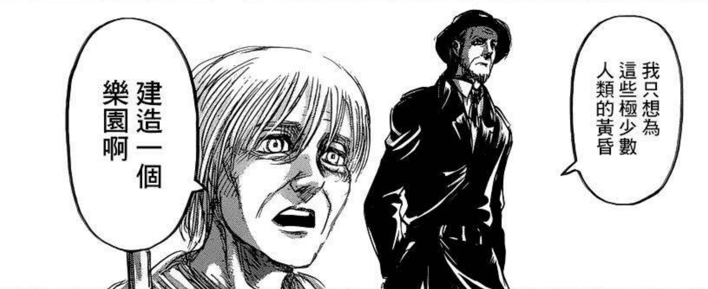

# 408环境介绍-理念部分

[返回杂谈（仅供娱乐）](../Tittle-Tattle.html)  

---

以下理念可能稍有**超前**。  
如果你只是想找个游戏玩就行的一般玩家，那可以不看这部分。  
如果你对本人创立408环境中一些**设定**及其**考量因素**感到好奇，希望**跨越纯游戏设计技术层面的边界**，那欢迎继续观看。  
以下内容抛砖引玉，主要针对**线上、校园类线下**等**青少年**为主的群体，其他线下场景不必然适用甚至会**适得其反**，请慎重考虑。  

如有**2014年之前，尤其是2008年之前的实卡经历**，则以下内容可能有丶扎心、残忍，本人在此建议：  
关掉，一定要关掉！  
真的不要看下去了！  
为了你好就关掉当不知道吧！  
如坚持观看，祝你好运。  

本部分内容实际上取自[《游戏王408环境介绍（低门槛轻度桌游）【修改前文案】》](https://www.bilibili.com/video/BV1iu4y1j76i/)，因有观众姥爷反映用语过于辛辣、刺激，心理上不太能接受，因此本人将其截取出来在保留本意的情况下温和化并独立发布。  
除了对一直以来部分疑问进行解答外，也有抛砖引玉，给后辈们提供宣传思路灵感的作用。  
以下是正式内容。  

---

本人也曾对OCG有浓厚兴趣，后来因大学毕业忙于工作，时间、精力与高中、大学时相距甚远，不得不尝试探索一些**不必频繁关注环境发展**的游戏方式，最后在类似组织的启发下研究并推广408环境。  
一开始采用**大师规则3**，后来转为**大师规则2020（不适用额外怪兽区）**的原因是，比起国内外多种民间原创赛制采用的新专家规则、大师规则、大师规则2，其**简化、直觉化**了很多规则，更便于一般通过群众感性认识，能更好地承前启后、继往开来。  

本人创立408环境，一开始是以“假情怀，真传教”（调侃）的方式，潜移默化地引导一些同龄上班族退坑老玩家或纯动画观众逐渐接受新规则，然后去了解并加入OCG（当时25岁左右，完全有回坑条件）。  
后来随着时间推移，我与同龄人**年龄逐渐增加，精力大不如前**。  
继续只盯着柴米油盐在生活中占比越来越高的80后、90后“薅”已难以为继，还是得放弃幻想，正视现状、着眼未来，将宣传重点逐渐转移向**00后、10后甚至20后**的新鲜血液，才不至于在5年、10年后乃至更久远的未来，原有大龄成员老龄化、继承的新鲜血液不足走下坡、断代，模组无人问津之时感叹当初“我只想为这些极少数的人类的黄昏，建造一个乐园啊”（悲）。  

    
     
    《进击的巨人》69话

要建立一个广泛传播的模组，考虑的除了一般玩家视角中游戏设计这种技术层面的因素外，**发展前景、竞争优劣势、可运用资源**等战略层面因素也是不可忽视的。  
这可比单纯创造一个**只供少数人玩**的民间原创赛制要难多了——毕竟少数人的“私伙局”可以随性而行，只要多数人同意即可，而建立一个**广泛传播**的模组，身边人的意见确实有重要的参考意义，但仅局限于此容易一叶障目。  
这里以一直以来仍有讨论的新旧规则、裁定适用分歧及其背后代表的思想内核来说明。  

---

假设完全照搬当年规则、裁定，很多当年的规则细节、裁定要么因互联网仍未十分发达而只能印在某些纸媒上，要么就藏在互联网中某些网站的角落里，无论是哪一种，都导致真要做到完全合规，取得资料的时间、精力成本都十分高，如果是只能购入二手纸媒材料，还得支付额外的经济成本，这会对部分玩家的积极性产生一定打击，同时也会增加“无结论”争议的发生，而为了定分止争，有时又不得不暂且采用**后世裁定**，在一定程度上公然违反了“旧规旧裁”的原则，构成两难局面，难以大范围推广、参考。  

而使用新规则、裁定后，除了能规避上述风险，也能利用**KONAMI官方数据库、日文wiki**，以及国内的**碎冰规则整合**等大型网站作为方便查询的有力工具。  
除了部分KONAMI真的极不负责让问现场裁判的“放权”式偷懒裁定外，基本上绝大多数规则、裁定问题都可以直接查到解决答案或者能通过类案进行有效推理得知结果。  
这样一来无论是在日常对战还是比赛中，玩家们起码有若干便利的数据库学规则、裁定加深游戏理解，也能以“有说服力的第三方”解决争议。  
哪怕408环境里部分卡适用的是旧效果，上述数据库中也有不少“虽然改文本了但**核心语句的新文本裁定仍有重大参考意义**”和“新旧文本差异过大但**后世其他‘新’卡的文本与旧文本类似完全可以参考**”的例子，对于解决争议而言不成明显问题。  

---

除上述游戏技术方面的因素外，经济、圈子内外的形势因素也是十分重要不可忽视。  
本人并非富家子弟，无法拿出太多资源续航，而实践也如我所料，大多数人只想当个普通玩家，愿意自办比赛，至少提供赞助奖品的人少之又少，更别说赞助线上服务器并及时更新程序，提供稳定且有一定流量的门户网站收录模组游戏信息、引流这些重要项目了。  

因此为了能更好地宣传、传承，接轨在游戏王圈内永远占据流量顶端的OCG，与OCG部分个人、团体**合作**获取资源赞助是必要之举。  
在80后、90后玩家逐渐从OCG中脱离，OCG圈子内具有可合作资源的个人、团体将逐渐由较少或根本没有那些回忆的00后、10后“长江后浪推前浪”式地补充的前提下，旧规则、裁定在**唤起回忆**的吸引力的优势将会消失殆尽。  
在节奏较快的现代生活，与时俱进、推陈出新的文化氛围中，00后、10后整体可能对“旧”规则、裁定这些“与现有生活经验无关”的事物并不感冒（当然也不至于厌恶就是了）。  
一旦在模组使用了旧规则、裁定并因此赋予其类似“旧环境”的刻板印象，洽谈合作时要花费的时间精力成本将会大大增加——“这类合作，对在OCG圈中的发展好处似乎并不明显，但也不好拒绝，那就卖个人情给个友情链接好了。”（设计台词）  

更何况现在不少民间原创赛制还在使用旧规则、裁定外火上加油地比较着重于“不喜欢OCG可以来”这类单向宣传意思的话术。这不是错，但给人的印象就是单纯来“分饼”。  
假如真的合作，则在增加额外成本之余，还分了OCG资源的饼“零和博弈”，如此一来对方就缺乏合作动力，更可能导致民间原创赛制玩家们要**自己筹备更多资源**以持续活动。  

相较而言，408环境在采用新规则、裁定的基础上，还有一定的OCG元素可协助招新——展现较新动画续作形象，在线上游戏的AI中保留新种类额外怪兽等，一步步**潜移默化**，减少部分（圈外）受众对OCG可能有的恐惧，平稳过渡，而非在规则、平面宣传上大刀阔斧与OCG要素进行切割——这会减少与OCG群体间的共同话题妨碍交流，更别说下一步了。  
而且408环境的潜在受众远不止是有回忆的老玩家、动画观众，更庞大群体——**对游戏王并无认识的普罗大众**（相较年轻玩家更无回忆可言），这片蓝海才是真正的星辰大海。  

OCG的游戏体验并不算很糟，但过于多彩的战术联动系统总是会吓跑不少一开始有兴趣的圈外群众。  
408环境可在此充当**中介**和**过渡**，让一部分人在玩408环境的过程中接触OCG的相关信息并产生兴趣。  
虽然转化率不算高，但毕竟还是有望能从普罗大众蓝海中额外培养新玩家，总体而言也算是为游戏王圈子的壮大作出贡献，合作洽谈时对方的感受也会好些，至少展现的形象主要不是“分饼”而是**互利互惠**，存在合作基础。  

---

关于民间原创赛制、模组之间，408环境面世以前就已有众多适用旧规则、裁定（部分是哪怕是再“旧”也超越了历史时代的大师规则2）的民间原创赛制，包括本土和舶来品。  
这些民间原创赛制的创立者和群组管理者们当时的决定没有错，但在当今形势，后来者如墨守成规地盲从前人，认为要创立一个模组就必须坚持旧规则、裁定而必须拒绝新规则、裁定，先不说刚才提到的“未来”走下坡，即使是“现在”，现有民间原创赛制之间也是竞争激烈，新模组一开始还比较弱小，缺乏足够的竞争力，较难从已经发展壮大的各前人赛制之间脱颖而出。  
而一旦击破思想的桎梏，我们会“顿觉天地宽”——既然原有赛道竞争激烈，何不大胆开辟一条独具特色、他人无法或不愿轻易复制的分赛道，自己当领跑者？  
现在408环境可以说是国内众多民间原创赛制、模组中，**创立理念、模式最大胆的，没有之一**（先叉个腰，国外情况不清楚，不敢妄下定论）。  

---

从结果来说，以上理念也算符合现实。  
408环境发展迅速，在国内游戏王圈子里算是远近闻名。  
在玩家人数多起来之后，部分玩家对一些规则有新构思。  
此时408环境因去中心化而具有的性质——**包容性、可塑造性**就体现出来了。  
在玩家群体承认“**OCG环境是本家，408环境是二创**”这一共识的前提下，有奇思妙想的玩家则可**另行建立社群**，不同的社群内可以像给游戏做模组（mod）般自行对玩法作出调整以获取新的乐趣，成为**三创**（部分可能另命名）。  
本人的社群将坚持**408环境（二创）为主**，同时包容部分呼声较高的三创，让有兴趣的群友日常约战时自行决定适用的规则。  
如此一来三创社群之间有408环境（二创）作为共同话题，兼顾个性张扬与共性交流，也能有效规避部分不同三创的玩家间争执不同规则孰优孰劣这种既无法直接改变对方社群适用规则又损伤同好和气的情况。  

---

最后讲个拓展小故事，阐述一下我会如上考虑并坚持的契机，同时希望能为同样有想法的后辈们提供前车之鉴。  
某城市实卡群1名玩家（原群主）在当地论坛宣传408环境并招人。  
结果1名管理与若干群员比较“原教旨主义”，三天两头说408环境“效果不对”“规则不对”“裁定不对”，与原群主对着干，且**拒绝不同玩法和平共处**，坚持群里**必须**按06年当时的规则、效果、裁定。  
最后原群主心灰意冷，将群主权力交给另一名后来“无为而治”的佛系群员后退群，而群内规则的样子最终变成了他（管理）的形状（不对）。  
我在那群里见证了这一过程，后来对其继续使用“408环境”的名义提出质疑后，该管理就将社群名称改为“06环境”。  
原群主退群的几个月后，我被该管理踢出。  
神奇的是，我找新群主询问情况时，该管理竟然还不向新群主说实话承认是他踢的，虽然新群主都已经看到群员管理记录明细知道怎么回事。  
上个版本撰稿时想起这段往事，大脑一时发热就针对这段经历和与该管理接触的体验写下了比较辛辣的话语，在此本人对被我不慎溅射误伤到的无辜玩家说句抱歉。  
现在我冷静下来，发现那名管理（以及若干群员？）对原教旨的爱和坚持其实算是一个优点。  
某种意义上说，这种坚持和爱也算值得尊敬、学习。  
毕竟没有绝对的好人，也没有彻底的坏人，该管理除了做事手段有丶不太厚道，比较冒犯原群主、伤害友情，“上位”过程讲出来不太好听外，似乎也没什么太严重的问题（摊手）。  

---

我讲述这个故事，除了想分享一下经历、让大家能把这个故事作为理解上述理念的背景外，还提供一个见证者视角的衷心建议：  
无论理念、措施看起来有多么正确，总会因与一部分人的**利益**或**观念**不符而遭到反对。  
如果你是一个408环境社群的管理者，其实无需纠结在“已有规则是否要改”的问题上不断内耗，大可打开格局，引导不愿妥协的成员**另设新社群**，与原社群建立**友好合作、互宣互驻**的关系。  
“**君子和而不同**”，如此可能反而有利于双方**各自安好**，保持和谐关系，也许还能达成其他合作如举办规则折中的比赛，促进两社群成员的友好交流，岂不美哉？  
否则为了争夺原社群规则制定的话语权而内斗至“不共戴天”，最后仍难免落至分道扬镳另设社群的相同结局，和谐关系却荡然无存，令人唏嘘不已。  
相识便是缘分，曾经的牌友之间何至于此？  
最后感谢大家愿意看我的高谈阔论。  
篇幅所限，只能言尽于此。  
如有兴趣进一步了解本人的理念，可看本人过往作品[《漫展宣传408环境心得+杂谈（锐评部分OCG现状）》](../2.2022-8-31/2.2022-8-31.html)。  

2023年12月3日  
神之吹息  