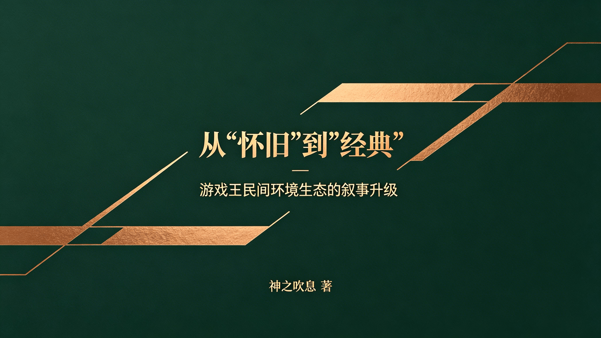

# 从“怀旧”到“经典”：游戏王民间环境生态的叙事升级

作者：神之吹息
发表日期：2026年4月3日
本文同时发表在“游戏王多元环境联合会”B站账号：https://www.bilibili.com/opus/1186906210770616340

[返回杂谈（仅供娱乐）](../Tittle-Tattle.html)

---

# 前言

**本文/视频参照CC BY（署名）协议开放转载，敬请保留原链接与作者信息噢~感谢传播！支持知识开放、协作与共享。**

欢迎各位读者姥爷看完后理性讨论，也欢迎I人读者姥爷私信投稿。**私信、私聊投稿视为同意本人在展示投稿内容的同时展示头像及ID等信息实名收录到本文附加部分或新开设的包含“投稿-回应”类型内容的文章、视频**。如有深度理解，也欢迎撰写长文公开讨论。

本文基于自2017年起九年游戏王社群（主要是408环境线上、线下社群）运营的**真实经验**、在各游戏王民间环境社群内交流**所见所闻**，及期间的**个人感想**。

九年民间环境运营，我目睹了一群人对民间环境的热爱，如何被身上的“**怀旧**”“**遗老**”等标签困住。为何千年棋牌能成**经典**，而我们却被嘲“遗老”？这不是游戏的问题，是**叙事**的问题。本文尝试作一次认知升级：**从怀旧到经典，从回忆到传承**。带你看清如何**撕掉偏见标签**，把我们守护的民间环境，活成能**跨代传承的经典**。

同时欢迎各位游戏王圈外的读者姥爷参照本文，将对应的经验抽象总结为可以**跨领域复用**的广泛经验。

欢迎**点赞、收藏、转发、评论**。

# 目录

> 一、开篇：一场关于“定义”的战争
> 二、厘清概念——“怀旧/情怀”与“经典”的本质区别
> 三、为什么要从“怀旧/情怀”转向“经典”？
> 四、如何潜移默化实现从“怀旧/情怀”到“经典”的转化？
> 五、结语：让民间环境成为这个时代的“经典”

# 一、开篇：一场关于“定义”的战争

不知各位读者姥爷有没有发现一个奇怪的现象？围棋、象棋、麻将，流传了上千年，从来没人说它们是“怀旧”“遗老”。年轻人学围棋，没人问他“你是不是在怀念古代”。可轮到游戏王的民间环境（比如408环境），画风就变了：“旧环境”“老卡池”“遗老”。为什么？难道**规则稳定、策略深邃**的408环境，比千变万化的围棋更“过时”？

当然不是。问题不在玩法，而在标签。“怀旧”这个词，像一顶**太小太旧的帽子**，硬扣在一个本可以很“经典”的东西上。它**劝退新人**——年轻人听到“怀旧”，第一反应是“与我无关”。它也被某些人当武器——“**你们就是一群遗老自嗨**”。而标签的背后，是**叙事权的缺失**。

我们并非只能守着 “怀旧” 的定位，更不该被不合理的标签束缚。所以，得做一件事：把“怀旧”换成“**经典**”。不是玩文字游戏，而是为民间环境争取它**本该有的认知地位**——像传统棋牌一样，**跨越时间、代际与偏见，成为真正可传承的经典**。

这，就是本人想与各位读者姥爷一起完成的**认知升级**：跳出 “怀旧” 的狭隘定义，转向 “经典” 的**正向叙事**，重塑民间环境的公众认知与生态自信。让 408环境等优质民间环境，像传统棋牌一样，凭借**稳定规则、深邃策略**，成为**跨越时代、历久弥新、被全年龄段认可**的经典玩法。

------

# 二、厘清概念：“怀旧/情怀”与“经典”的本质区别

以下词义均来源于**《现代汉语词典》（第5版，2005年）**。

> **怀旧**：[动]**怀念往事**和旧日有来往的人。
> **情怀**：[名]含有某种**感情**的**心境**。
> **经典**：①：[名]指传统的具有权威性的著作。②：[名]泛指各宗教宣扬教义的根本性著作。③：[形]著作具有权威性的。**④：[形]事物具有典型性而影响较大的。**

由此可见，“怀旧”的核心在于**依附个人记忆与过去情绪，被动、向后看**，用于民间环境标签，易被污名化为 “老旧”，难以吸引新生代，无法支撑长期生态。而“情怀”，主观情感偏好，是**起步初心**，但缺乏客观价值标准，不能作为环境可持续发展的核心支柱，易陷入**道德化、封闭化**。共通点是**依赖个人记忆、情绪投射，时间属性强**（“过去式”），易被污名化为“过时”“遗老”。即便这**不等于说游戏不好**，但依然会**劝退新人、限制生态想象**。

而“经典”则明确指向规则稳定、策略深邃，能**跨代传承、具备独立玩法价值**，且**不受时间侵蚀**的方向——不仅具有当下价值，而且完全有望在未来可持续，生生不息。经典不靠回忆续命，而靠当下好玩、未来可持续。现有的多个民间环境已具备经典的核心特质，只是局限于“怀旧”、未被正确叙事，以致**在第一印象上就吃了大亏**，需要重新定义与表达。

当然，本人**不否定“情怀”，但拒绝“只靠情怀”**。民间环境不仅仅是“老玩家的记忆”，而是“**稳定规则下的无限博弈**”——这正符合经典的词义。**情怀是初心，不是标签；经典是目标，底色是价值**。

------

# 三、为什么要从“怀旧/情怀”转向“经典”？

说到底，一个标签决定一个生态的命运。

## 当前“怀旧/情怀”标签的三大负面影响——戴帽容易摘帽难

首先，它**天然劝退年轻人**。你想想，一个00后听到“怀旧/情怀环境”，第一反应是什么？“那是老一辈的东西，**跟我没关系**。”——还没了解玩法，人已经被标签挡在门外。本人在大学母校牌佬群里宣传408环境时，一位师弟的回答点醒了本人——“**每个人的情怀都是不一样的**”。即，我们以为情怀是共鸣，对方却觉得是绑架。如果真心希望广大牌佬感受民间环境的乐趣，却只宣传“怀旧/情怀”，何尝不是一种无意识的“**以己度人**”？生态没了**新鲜血液**，就只能**在一群老面孔里慢慢萎缩**。

其次，它**给了某些人现成的攻击武器**。**部分优越感牌佬**的“遗老”“守旧”“小圈子自嗨”等词为什么能张口就来？因为“怀旧/情怀”自己就把软肋露出来了。他们不需要了解民间环境的策略深度，只要甩出“怀旧/情怀”甚至“遗老”两个字，就能让民间环境玩家们百口莫辩——“**这可是你们自己承认的，我可从没有乱编乱扣帽子哦~**”

更致命的是，它**限制了生态的想象力**。“怀旧”是向后的，让人总在回忆里打转；“经典”是向前的，让人期待未来还能玩出什么新花样。一个**总被困在缅怀过去**的环境，社群里面的玩家自己都在营造出只想沉醉于**以过去之虚像消极避世的“幻术”**氛围中，而不去表达民间环境**自身的独特魅力**，那还怎么吸引想往前看的玩家？

##  “经典”叙事的核心价值——换一个词，换一个世界

“经典”就不一样了。它意味着“**值得一直玩下去**”——年轻人听到“经典”，不会觉得与自己无关，反而会好奇“这东西能成为经典，一定有点东西”，从而减少忽视、抵触，从源头上**增加民间环境自我展示的机会**。

它能帮我们**建立正面的身份认同**。从“我是怀旧玩家”到“我是**经典环境的守护者**”，心态完全不同——前者带着点**自嘲**，后者满是**自信**。还能让我们和**围棋、象棋、麻将**这些真正的经典站在一起。没有人会问“你为什么还在下围棋”，因为**经典不需要解释**。我们的环境，也该有这样的底气。

更重要的是，它能让那些**攻击话语瞬间失效**。当你的定位是“经典”，对方再喊“遗老”，就像对着珠穆朗玛峰喊“小土坡”——可笑的是他，不是你。

我们民间环境，也要有自己的“**道路自信、理论自信、制度自信、文化自信**”！即便只玩民间环境，那也并非**不得不安于旧日的无奈或自嘲**，而是**对其传世魅力认同的热爱与坚持**。

## 叙事转向的必要性——不转，就真会被困在“怀旧/情怀”的笼子里了

年轻玩家不会主动走进“怀旧”的门，但会**主动探索“经典”的世界**。这不是文字游戏，这是认知门槛。跨不过去，生态就会在“小圈子自嗨”里慢慢沉寂；跨过去了，才有代代相传的可能。

仔细想想，不止传统棋牌，中国四大名著、古典音乐、印在课本上的历史绘画雕塑建筑等中外艺术创造，哪个是凭借“怀旧/情怀”立于现世？依靠的还不是其丰厚的**价值底蕴**，令人回味无穷、意犹未尽、常品常新的**精神深度**？

更何况，本人在408环境的各种宣传资料中，已尽可能放弃“情怀”“怀旧”“老”“旧”等，更换为“经典”“传承”等词汇，宣传效果却并未削弱。大量真正的当年老玩家依然感到408环境**契合其情怀**，未有冒犯。也就是说，叙事转向经典后，不仅**“情怀”能被完美包容**，而且**丝毫不影响展示面对未来的自信**——**表达正面化、信息量增加**，岂不美哉？

所以，换标签不是玩概念，是**救命**。

------

# 四、如何潜移默化实现从“怀旧/情怀”到“经典”的转化？

**核心原则**：不争论、不纠正、不硬推，用“润物细无声”的方式，让玩家主动认可“这是经典”。

## 话术重构：统一口径，最易落地

从自身做起，所有**宣传、群聊、比赛文案**统一替换：

- “怀旧/情怀环境” → “经典环境”。
- “老卡池” “旧环境”→ “经典卡池”“民间环境”。
- “情怀玩家” “遗老” → “资深玩家”“传承玩家”。

**规避词（不强求他人）**：不再主动使用“怀旧、老旧、遗老”等**自我矮化**词汇。

**宣传文案抛砖引玉**：

> 408环境规则省流版
> ▷ 采用大师规则2020（不适用额外怪兽区）
> ▷ 改订前效果+最新裁定
> ▷ 传承自2006年3月限制卡表+第四期卡池
> *保留经典策略框架，同时规避旧规则复杂度

## 内容重塑：突出“经典价值”，而非“回忆情绪”

**强调策略深度**：多产出卡组思路、对局逻辑、环境combo（组合技）内容，像围棋讲定式一样讲民间环境的博弈。

**展示代际活力**：多发年轻玩家的对局视频、访谈，让“00后、10后也爱经典”成为可见事实。

**价值锚定**：反复强调平衡性、纯粹性——“无丧病超模卡，媲美甚至超越OCG环境的操作考验”。本人在大学母校牌佬群举办比赛的场外推广活动中，给当时的OCG环境牌佬参赛者轻度体验了408环境的预组卡组，部分体验、围观牌佬甚至兴奋到高呼“这不比OCG环境好玩多了？”（笑）

如有条件，可以统计**玩家年龄分布、比赛参与人数、卡组多样性**，用数据证伪“只有遗老”。

## 生态展示：打破“中老年专属”印象

**活动分享**：多放**年轻人日常打牌、参赛**的照片、战报信息。同时欢迎观看本人与母校在校师弟们的408环境决斗视频。（笑）

**弱化资历**：不说“老玩家”，只说“某民间环境玩家”。

**日常渗透**：偶尔提一句“最近好多学生党入坑，说这环境经典”。

## 长期渗透心法：不硬推，靠展示+暗示

**不争辩**：别人说“怀旧”，不反驳，只用事实回击——发年轻玩家数据、发精彩对局。

**每提必带“经典”**：形成语言肌肉记忆，不突兀的情况下多说“经典”。

**借棋牌背书**：偶尔类比但不说教——“围棋没人说怀旧，经典就是经典”。

## 代际传承：培育新生代经典玩家

办**新人体验赛、教学局**。本人在每年7-8月毕业季，会举办408环境线上赛“**毕业杯**”，借用纯预组卡组固定构筑的比赛，大幅降低新人体验、参与比赛的成本，以便进一步转化长期入坑。

推“**新星战报**”专栏，**让年轻人当主角**。本人长期在自己408环境线下比赛战报中强调初次参赛、外地玩家数的同时，一并列出“初中生”“高中毕业生”等年轻玩家，正是在落地本方案。

建可持续的**教学-比赛-社群**链路。本人在B站发布多个教学视频文章、不定期举办比赛（包括新生杯）、维护千人线上社群，为408环境玩家们提供更好的一站式入坑流程和长期打牌氛围、基建。

------

# 五、结语：让民间环境成为这个时代的“经典”

经典从来不是天生的。围棋下了四千年，不是靠“老祖宗传下来的”这几个字撑着，而是一代又一代人走进去，发现它**好玩、耐玩、值得一直玩下去**。

我们的民间环境也一样。408（及SP群改版）、506、2011探索者、1103等环境，它们不缺**策略深度**，不缺**平衡性**，不缺**愿意投入的玩家**。缺的只是一次**认知上的正名**——从“怀旧”到“经典”，从“回忆”到“传承”。这不是文字游戏。这是**为热爱争取它本该有的位置**。

从今天起，**本人建议规避自称“怀旧”，开始自称“经典”**。用行动、用内容、用带给大家的笑容，重新定义我们热爱的东西。

**怀旧是向后看，经典是向前走。我们选择向前**。愿我们的环境，像传统棋牌一样，**跨越时间、代际与偏见**，成为真正可传承的经典。毕竟**情怀时间长了就没了**，而**经典足以穿越时空，进行跨时代的对话**。